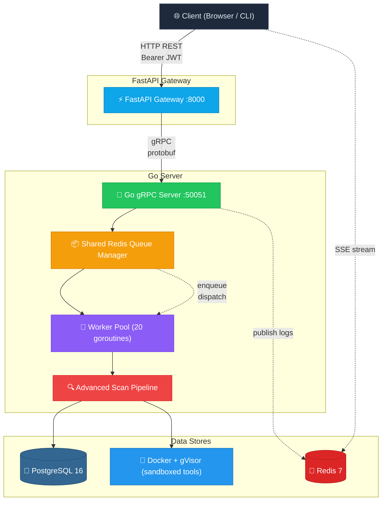

# Auto-Offensive Backend

Automated security scanning platform that orchestrates offensive security tools through a REST API backed by a gRPC execution engine, shared Redis job queue, and sandboxed Docker + gVisor containers.

Users submit Unix-style pipeline commands (e.g., `subfinder -d example.com | httpx | naabu`) and the system parses them into sequential steps, runs each tool in isolated containers, pipes output between steps, streams logs in real-time, and persists structured findings to PostgreSQL.

## Features

- **Pipeline-Based Scanning** — Submit Unix-style commands with pipe chaining; output from one tool becomes input to the next
- **SonarQube Scan Service** — Dedicated gRPC service for async code-quality scans, issue browsing, issue detail fetch, and scan status streaming
- **7 Integrated Security Tools** — subfinder, httpx, naabu, nmap, nuclei, gobuster, gitleaks
- **Real-Time Log Streaming** — Server-Sent Events (SSE) via Redis pub/sub for live monitoring
- **Sandboxed Execution** — Docker + gVisor kernel-level isolation per tool
- **Three Scan Modes** — Basic (single tool), Medium (typed options), Advanced (full pipeline)
- **JWT Authentication** — Keycloak OAuth2/OIDC with role-based access control
- **Structured Findings** — Automatic parsing and deduplication of vulnerabilities, hosts, ports, secrets
- **Extensible Tool Registry** — Add new tools via JSON definitions without code changes

## Quick Start

```bash
# Option 1: Docker Compose (recommended)
docker compose up --build

# Option 2: Local development
# See individual service READMEs for setup instructions
```

| Service         | Access                  | Description                        |
| --------------- | ----------------------- | ---------------------------------- |
| FastAPI Gateway | `http://localhost:8000` | HTTP REST API, SSE streaming, docs |
| Go gRPC Server  | internal only           | Core execution engine              |
| PostgreSQL      | internal only           | Persistent storage                 |
| Redis           | internal only           | Job queue + pub/sub log streaming  |

API documentation: `http://localhost:8000/docs`

## SonarQube Scan Service

This repo now includes an isolated SonarQube scan pipeline:

- Go gRPC service: `sonarqube.proto` + `SonarqubeService`
- FastAPI REST adapter:
  - `POST /scans`
  - `GET /scans/{scan_id}/status`
  - `GET /scans/{scan_id}/summary`
  - `GET /scans/{scan_id}/issues`
  - `GET /scans/{scan_id}/issues/{issue_key}`
  - `GET /scans/{scan_id}/files/{file_path}/issues`
  - `GET /projects/{project_key}/scans`
  - `GET /scans/{scan_id}/stream`

### Required Environment

Set these for the Go service:

- `SONARQUBE_BASE_URL`
- `SONARQUBE_TOKEN`
- `GRPC_PORT`
- `DB_DSN` or `DATABASE_URL`

Optional:

- `SONAR_SCANNER_BIN` (default: `sonar-scanner`)
- `REDIS_ADDR`
- `LOG_LEVEL`

### Development

```bash
# generate Go + Python protobuf stubs
make proto

# run the gRPC server entrypoint used by Docker
make run

# run Go tests
make test

# apply migrations
make migrate
```

## Architecture Overview



## How It Works

### 1. Scan Submission

1. Client `POST /scans/advanced/submit` with a unix command like `subfinder -d example.com | httpx`
2. FastAPI validates the JWT token (Keycloak) and request body (Pydantic)
3. FastAPI proxies to Go server via gRPC
4. Go parses the command into ordered steps, creates DB records, and **enqueues** to Redis
5. Go returns immediately with `job_id` and `status=QUEUED`

### 2. Queue Execution

1. Global worker pool (20 goroutines) pulls jobs from Redis
2. Worker reads `ServiceName` and dispatches to the correct handler
3. Handler executes steps sequentially — each tool runs in an isolated Docker + gVisor container
4. Tool output is captured via stdout piping, shadowed to files, and streamed to Redis pub/sub
5. Results are parsed and persisted as findings in PostgreSQL
6. Worker marks the job complete

### 3. Real-Time Log Streaming

- Each log line is published to Redis pub/sub as it's produced
- FastAPI subscribes and forwards logs to the browser via Server-Sent Events (SSE)
- The client uses `EventSource` for live log display

### Scan Modes

| Mode         | Description                           | Use Case                           |
| ------------ | ------------------------------------- | ---------------------------------- |
| **Basic**    | Single tool execution                 | Quick scans, simple reconnaissance |
| **Medium**   | Typed options with structured input   | Parameterized scans                |
| **Advanced** | Full Unix pipeline with tool chaining | Complex multi-step workflows       |

### Tool Registry

Tools are defined entirely by JSON metadata — no code changes needed. Each JSON defines:

- `input_schema` — how the tool receives input (fields, flags, pipeline input mode)
- `output_schema` — SSE display format, pipeline output extraction, finding fields
- `shadow_output_config` — streaming (stdout JSONL) vs file-based (XML/JSON) output capture
- `scan_config` — basic presets (light/deep), medium typed options, advanced raw flags
- `parser_config` — field mappings for findings, severity defaults, dedup fingerprint fields
- `denied_options` — security blocklist for dangerous flags

See [ADDING_TOOLS.md](./ADDING_TOOLS.md) for the complete guide.

### Integrated Tools

| Tool             | Category               | Purpose                                 | Output Format     |
| ---------------- | ---------------------- | --------------------------------------- | ----------------- |
| **subfinder**    | Reconnaissance         | Passive subdomain enumeration           | JSONL stdout      |
| **httpx**        | Reconnaissance         | HTTP probing with metadata extraction   | JSONL stdout      |
| **naabu**        | Reconnaissance         | Fast port scanning                      | JSONL stdout      |
| **nmap**         | Network Discovery      | Service detection and OS fingerprinting | XML file          |
| **nuclei**       | Vulnerability Scanning | Template-based vulnerability detection  | JSONL stdout      |
| **gobuster-dir** | Directory Enumeration  | Directory/file brute-forcing            | Line-based stdout |
| **gitleaks**     | Secret Detection       | Find secrets in source code/git history | JSON array stdout |

## Key Architectural Patterns

| Pattern                | Description                               | Benefit                                                |
| ---------------------- | ----------------------------------------- | ------------------------------------------------------ |
| **API Gateway**        | FastAPI fronts Go gRPC services           | Separation of HTTP/auth from execution logic           |
| **Shared Queue**       | Redis FIFO queue with visibility timeouts | Crash recovery, fair scheduling across services        |
| **Pipeline Transport** | Unix pipe semantics between steps         | stdout of one tool → stdin of the next                 |
| **Shadow Output**      | Dual capture: streaming + file-based      | Real-time logs + structured artifact persistence       |
| **Command Parser**     | Parses raw commands into typed steps      | Policy enforcement, type coercion, flag classification |
| **Idempotency**        | SHA-256 request hash deduplication        | Safe retries without duplicate execution               |
| **gVisor Sandbox**     | Kernel-level isolation per tool           | Prevents container escape, limits blast radius         |

## Tech Stack

| Component   | Technology                               | Purpose                                  |
| ----------- | ---------------------------------------- | ---------------------------------------- |
| HTTP API    | FastAPI (Python 3.13)                    | REST endpoints, JWT auth, SSE streaming  |
| Core Server | Go 1.25 + gRPC                           | Scan execution, queue management, Docker |
| Database    | PostgreSQL 16                            | Users, projects, tools, jobs, findings   |
| Queue       | Redis 7                                  | Shared job queue, pub/sub log streaming  |
| Execution   | Docker + gVisor (runsc)                  | Sandboxed container execution            |
| Auth        | Keycloak (OAuth2/OIDC)                   | JWT verification, role-based access      |
| Code Gen    | Protocol Buffers, sqlc, Goose migrations | Type-safe gRPC stubs and SQL queries     |

## Directory Structure

| Directory                                          | Purpose                                                                                 |
| -------------------------------------------------- | --------------------------------------------------------------------------------------- |
| [`fastapi-gateway/`](./fastapi-gateway/)           | Python HTTP API gateway — REST routes, JWT auth, gRPC client wrappers                   |
| [`go-server/`](./go-server/)                       | Go gRPC server — scan execution, queue management, Docker orchestration                 |
| `proto/`                                           | Protocol Buffer definitions for all 8 gRPC services                                     |
| `*.json`                                           | Tool definitions (nmap, nuclei, subfinder, httpx, naabu, gobuster, gitleaks)            |
| [`ADDING_TOOLS.md`](./ADDING_TOOLS.md)             | Guide for adding new security tools via JSON                                            |
| [`advanced_scan_flow.md`](./advanced_scan_flow.md) | Deep dive into the advanced scan execution pipeline                                     |
| [`Future_Improvement.md`](./Future_Improvement.md) | Proposed enhancements with implementation details                                       |
| `workers/`                                         | Python-based Docker image builder and scanner worker                                    |
| `Makefile`                                         | Proto generation, sqlc, goose migrations, run commands                                  |
| `docker-compose.yml`                               | Backend stack orchestration (Redis, Postgres, Keycloak, SonarQube, Go, FastAPI, worker) |

## gRPC Services

| Service                 | RPCs | Description                                                                          |
| ----------------------- | ---- | ------------------------------------------------------------------------------------ |
| **AdvancedScanService** | 11   | Submit scans, status queries, queue management, SSE streaming, results, cancellation |
| **BasicScanService**    | 5    | Single tool scans (delegates to advanced)                                            |
| **MediumScanService**   | 8    | Typed option scans                                                                   |
| **ToolService**         | 5    | Tool CRUD, build job management, image updates                                       |
| **CategoryService**     | 5    | Tool category CRUD                                                                   |
| **ProjectService**      | 5    | Project CRUD                                                                         |
| **UserService**         | 8    | User CRUD, GitHub provider accounts, SonarQube scan history                          |
| **APIKeyService**       | 4    | API key creation, validation, revocation, scoping                                    |

## Full Documentation

- [**Go Server**](./go-server/README.md) — Complete endpoint listings, scan architecture, execution pipeline, patterns, project structure
- [**FastAPI Gateway**](./fastapi-gateway/README.md) — REST endpoints, authentication flow, gRPC clients, SSE streaming, user lifecycle
- [**Adding Tools**](./ADDING_TOOLS.md) — JSON schema reference, SSE display control, pipeline chaining, output class decision tree
- [**Advanced Scan Flow**](./advanced_scan_flow.md) — Data models, submission flow, queue execution, command parsing, gVisor runtime, status tracking
- [**Future Improvements**](./Future_Improvement.md) — Native C++/Rust performance libraries, XML-to-JSON conversion, policy checking, idempotency hashing

## Development Commands

```bash
# Generate protobuf code (Go + Python)
make proto

# Generate type-safe Go from SQL queries
make sqlc

# Database migrations
make goose-up      # Apply migrations
make goose-down    # Rollback last migration
make goose-status  # Show migration status
make goose-reset   # Reset to specific version

# Run Go server (local)
make run-go                # Standard mode
make run-go-sudo-os        # With sudo (required for nmap)

# Run FastAPI gateway (local)
cd fastapi-gateway && uv run uvicorn main:app --reload --host 0.0.0.0 --port 8000
```
