# Advanced Scan Flow — Architecture & Execution Guide

## Table of Contents

1. [Overview](#overview)
2. [Key Components](#key-components)
3. [Data Model](#data-model)
4. [Request Submission Flow](#request-submission-flow)
5. [Queue-Based Execution](#queue-based-execution)
6. [Command Parsing Flow](#command-parsing-flow)
7. [Step Execution Flow](#step-execution-flow)
8. [Output Classes: JSONL Streaming vs File-Based](#output-classes-jsonl-streaming-vs-file-based)
9. [Real-Time Log Streaming (Fan-Out)](#real-time-log-streaming-fan-out)
10. [Pipeline Transport (Inter-Step Piping)](#pipeline-transport-inter-step-piping)
11. [Shadow Output Capture](#shadow-output-capture)
12. [Result Persistence & Finding Extraction](#result-persistence--finding-extraction)
13. [Idempotency Mechanism](#idempotency-mechanism)
14. [Policy & Security Deny List](#policy--security-deny-list)
15. [Runtime Configuration (gVisor / Network / Capabilities)](#runtime-configuration-gvisor--network--capabilities)
16. [Status Tracking & Job Lifecycle](#status-tracking--job-lifecycle)
17. [Background Cleanup](#background-cleanup)

---

## Overview

The `advanced_scan` module implements a **multi-step, pipelined, Docker-based security scanning system**. Users submit Unix-style pipeline commands (e.g. `subfinder -d example.com | httpx -silent`) that are parsed into sequential steps. Each step runs in an isolated Docker container, with output from one step piped as input to the next.

### Architecture Highlights

- **Queue-Based Execution**: Jobs are enqueued via Redis and processed by a shared queue manager with capacity limits
- **Dual Output Classes**: Tools are classified as `ClassStdoutJSONL` (real-time streaming) or `ClassFileOnly` (post-run file capture)
- **Real-Time Fan-Out**: JSONL tools stream output to SSE, shadow buffers, and pipeline inputs simultaneously
- **Policy Enforcement**: Global and per-tool deny lists block dangerous flags
- **Isolation**: gVisor runtime, network mode restrictions, and no privileged execution

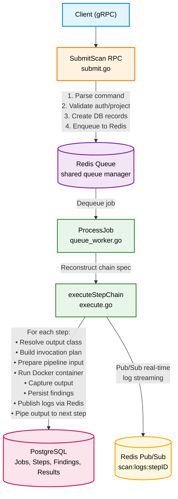

---

## Key Components

| File                    | Responsibility                                                                                |
| ----------------------- | --------------------------------------------------------------------------------------------- |
| `advanced_scan.go`      | Server struct, constructor, in-memory state, background cleanup                               |
| `submit.go`             | `SubmitScan` RPC, idempotency, target resolution, DB creation, queue enqueue                  |
| `queue_worker.go`       | `ProcessJob` — dequeues jobs from Redis, reconstructs chain specs, executes step chain        |
| `execute.go`            | `executeStepChain` — sequential Docker execution, output class dispatch, failure handling     |
| `stream_fanout.go`      | `runStdoutJSONLStep` / `runFileOnlyStep` — output class execution paths                       |
| `command_parser.go`     | Unix pipeline parsing (pipe splitting), quote-aware tokenization, step token parsing          |
| `policy.go`             | `BuildAdvancedInvocation` — flag validation, denied flags, input injection, argv construction |
| `pipeline_transport.go` | Inter-step data piping — list file transport, line extraction, deduplication                  |
| `shadow_transport.go`   | Shadow output preparation/capture — file mount, format selection, stdout fallback             |
| `runtime_config.go`     | Docker runtime resolution — gVisor, network mode, capabilities                                |
| `image_policy.go`       | Image pull policy based on tool source (dockerhub vs custom/local)                            |
| `logging.go`            | `publishLog` — Redis Pub/Sub log streaming to clients                                         |
| `results.go`            | `GetResults` RPC, findings pagination/filtering, raw output/parse metadata lookup             |
| `persistence.go`        | Artifact writing, finding parsing (XML/JSON/line), DB writes, severity normalization          |
| `helpers.go`            | Utilities — idempotency hash, job status derivation, status sync                              |
| `status.go`             | Protobuf ↔ DB status mapping, runtime snapshots                                               |

---

## Data Model

### In-Memory State (per server instance)

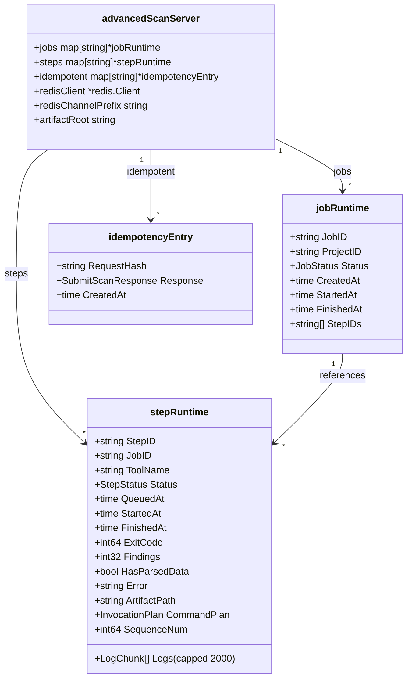

### Database Tables (PostgreSQL via sqlc)

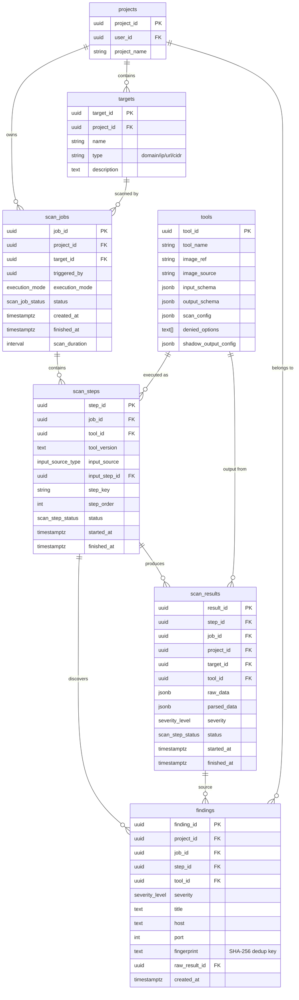

---

## Request Submission Flow

### Entry Point: `SubmitScan` RPC (`submit.go`)

```mermaid
flowchart TD
    classDef start fill:#e8f5e9,stroke:#2e7d32,stroke-width:2px,color:#000
    classDef process fill:#e3f2fd,stroke:#1565c0,stroke-width:2px,color:#000
    classDef decision fill:#fff3e0,stroke:#e65100,stroke-width:2px,color:#000
    classDef subgraph_style fill:#f5f5f5,stroke:#9e9e9e,stroke-width:2px,color:#000
    classDef endnode fill:#ffebee,stroke:#c62828,stroke-width:2px,color:#000
    classDef success fill:#e8f5e9,stroke:#2e7d32,stroke-width:2px,color:#000
    classDef error fill:#ffebee,stroke:#c62828,stroke-width:2px,color:#000

    Start([Client SubmitScan Request]):::start --> ValidateProject["Validate project_id is valid UUID"]:::process
    ValidateProject --> GenIdem["Generate idempotency_key if missing"]:::process
    GenIdem --> Normalize["normalizeSubmittedStepsForRequest<br/>parse command string → submittedStepInput[]"]:::process

    subgraph Parse ["Command Parsing"]
        Normalize --> Split["splitUnixCommandPipeline<br/>splits on | preserving quotes"]:::process
        Split --> Tokens["parseCommandStepTokens<br/>maps flags → tool_args, raw custom flags"]:::process
        Tokens --> DeriveTarget["deriveTargetValueFromStep<br/>extracts target from first step"]:::process
    end

    DeriveTarget --> ValidateTool["Validate at least one tool"]:::process
    ValidateTool --> FillTarget["If target_id and target_value are both empty:<br/>use derived target from first step"]:::process
    FillTarget --> HashReq:::process

    subgraph Idempotency ["Idempotency Check"]
        HashReq["idempotencyHashForRequest<br/>SHA-256 hash (excludes retry fields)"]:::process --> CheckCache{"In idempotent cache?"}:::decision
        CheckCache -->|"Found + same hash"| Replay["Replay cached response<br/>IsIdempotentReplay = true<br/>OriginalRequestId = original first step_id"]:::success
        CheckCache -->|"Found + different hash"| AlreadyExists["AlreadyExists error"]:::error
        CheckCache -->|"Found + no response"| Aborted["Aborted — retry shortly"]:::error
        CheckCache -->|"Not found"| Register["Register entry, continue"]:::process
    end

    Replay --> End([Return Response]):::endnode
    AlreadyExists --> EndFail1([Error]):::error
    Aborted --> EndFail2([Error]):::error

    Register --> BuildChain["For each step:<br/>• Resolve tool from DB<br/>• Validate custom flags syntax<br/>• Build chainStepSpec list"]:::process
    BuildChain --> ValidateIDs["Validate optional job_id / step_id UUIDs"]:::process
    ValidateIDs --> AuthCheck["Auth: RequireUserID from interceptor"]:::process
    AuthCheck --> VerifyProject["Verify project belongs to user"]:::process
    VerifyProject --> ResolveTarget{"Resolve or create target?"}:::decision

    ResolveTarget -->|"target_id is UUID"| LookupTarget["Lookup existing target by UUID"]:::process
    ResolveTarget -->|"target_id is non-UUID"| FallbackTarget["Treat target_id as target_value<br/>(backward-compatible fallback)"]:::process
    ResolveTarget -->|"target_value provided"| CheckExisting["Check existing by name<br/>(case-insensitive, trimmed)"]:::process
    FallbackTarget --> CheckExisting
    CheckExisting -->|"found"| UseExisting["Use existing target"]:::process
    CheckExisting -->|"not found"| CreateTarget["CREATE target<br/>with inferred type<br/>(domain/ip/url/cidr)"]:::process

    LookupTarget --> CreateJob["CreateScanJob in DB"]:::process
    UseExisting --> CreateJob
    CreateTarget --> CreateJob
    CreateJob --> CreateSteps["For each step:<br/>CreateScanStep, set PENDING<br/>Fill UUIDs into chain spec"]:::process
    CreateSteps --> BuildResp["Build SubmitScanResponse<br/>job_id, first step_id, status=QUEUED"]:::process
    BuildResp --> RegisterMemory["Register job + steps in-memory<br/>Update idempotency entry"]:::process
    RegisterMemory --> PublishQueued["Publish 'step queued' logs via Redis"]:::process
    PublishQueued --> BuildPayload["Build queuePayload<br/>with steps, execution_config, shadow_config"]:::process
    BuildPayload --> Enqueue["qm.EnqueueWithCapacityCheck<br/>enqueue to Redis queue"]:::process

    Enqueue --> QueueFull{"Queue full?"}:::decision
    QueueFull -->|"Yes"| QueueFullResp["Return QUEUED response<br/>status=QUEUE_FULL, retry_after=60s"]:::process
    QueueFull -->|"No"| LaunchWorker["Worker dequeues → ProcessJob<br/>→ executeStepChain in background"]:::process

    QueueFullResp --> ReturnResp["Return response immediately"]:::process
    LaunchWorker --> ReturnResp
    ReturnResp --> End([Response to Client]):::endnode
```

---

## Queue-Based Execution

### How Jobs Flow Through the System

Unlike traditional direct execution, advanced scan jobs flow through a **Redis-backed queue** with a shared worker pool:

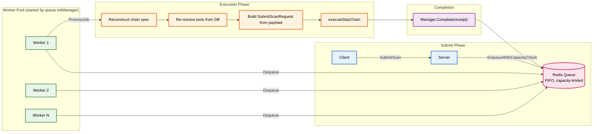

### `ProcessJob` Flow (`queue_worker.go`)

1. **Dequeue**: Worker receives job payload from Redis queue
2. **Reconstruct**: Rebuild `chainStepSpec[]` from payload steps
3. **Re-resolve**: Look up each tool from DB (ensures fresh config)
4. **Build Request**: Reconstruct `SubmitScanRequest` from execution_config and shadow_config JSON
5. **Execute**: Call `executeStepChain(request, chain)`
6. **Complete**: Mark job as complete in queue manager

---

## Command Parsing Flow

The advanced scan accepts a **Unix-style pipeline command** instead of structured tool args. Example:

```
subfinder -d example.com -silent | httpx -path /login -silent | naabu -top-ports 1000
```

### Step 1: `splitUnixCommandPipeline`

A custom tokenizer that:

- Splits on `|` (pipe character)
- **Preserves quoted strings** (single and double quotes)
- Handles escape sequences (`\`)
- Rejects unterminated quotes or escapes

```
Input:  subfinder -d "example.com" | httpx -path '/admin area' -silent

Output: [["subfinder", "-d", "example.com"], ["httpx", "-path", "/admin area", "-silent"]]
```

### Step 2: `parseCommandStepTokens` (per segment)

For each tokenized segment:

1. Resolve tool by first token (tool name)
2. Parse input_schema and scan_config JSON
3. Build input flag index (normalized flag → field spec)
4. Build option index (scan_config options)
5. Iterate remaining tokens:
   - **Input flags** (from input_schema) → map to `ToolArgs[key]`
   - **Option flags** (from scan_config) → map to `ToolArgs[key]` as strings
   - **Unknown flags** → append to `RawCustomFlags`
   - **Positional args** → map to positional input fields (fields without a flag)

Type coercion for declared option values happens later in `buildAdvancedInvocation`, not during command parsing.

### Step 3: Target Derivation

From the first step, extract the target value by checking:

1. Preferred keys: `target`, `host`, `hostname`, `domain`, `url`, `ip`, `cidr`
2. First non-empty input field as fallback

---

## Step Execution Flow

### `executeStepChain` — The Core Loop (`execute.go`)

```mermaid
flowchart TD
    classDef loop fill:#f5f5f5,stroke:#616161,stroke-width:2px,color:#000
    classDef process fill:#e3f2fd,stroke:#1565c0,stroke-width:2px,color:#000
    classDef decision fill:#fff3e0,stroke:#e65100,stroke-width:2px,color:#000
    classDef fail fill:#ffebee,stroke:#c62828,stroke-width:2px,color:#000
    classDef success fill:#e8f5e9,stroke:#2e7d32,stroke-width:2px,color:#000
    classDef endnode fill:#e0e0e0,stroke:#424242,stroke-width:2px,color:#000

    LoopStart["for idx, spec := range chain"]:::loop --> MarkRunning["markStepRunning<br/>DB + in-memory → RUNNING"]:::process
    MarkRunning --> ParseScanCfg["parseScanConfig for runtime"]:::process
    ParseScanCfg --> ResolveRuntime["resolveToolRuntime<br/>(gVisor, network, capabilities)"]:::process
    ResolveRuntime --> LogStart["Publish 'starting docker container'"]:::process

    LogStart --> IsFirstStep{"idx > 0?"}:::decision
    IsFirstStep -->|"Yes"| PreparePipe["preparePipelineInput<br/>pipe previous step output"]:::process
    IsFirstStep -->|"No"| ParseFlags:::process

    PreparePipe --> PipeMode{"multi_mode?"}:::decision
    PipeMode -->|"list_file"| ListFile["Create ContainerFile<br/>Inject -list flag<br/>Mount as container file"]:::process
    PipeMode -->|"default"| ApplyPipe["ApplyPipeInputs<br/>fill first missing required"]:::process

    ListFile --> ParseFlags["Parse custom flags from raw"]:::process
    ApplyPipe --> ParseFlags

    ParseFlags --> SetTarget["Set target value<br/>(only for first step)"]:::process
    SetTarget --> BuildInvocation["buildAdvancedInvocation<br/>policy validation"]:::process

    BuildInvocation --> ValidateInputs{"Required inputs<br/>present?"}:::decision
    ValidateInputs -->|"No"| FailPolicy["FAILED: missing inputs"]:::fail
    ValidateInputs -->|"Yes"| CheckDenied{"Any denied flags?"}:::decision
    CheckDenied -->|"Yes"| FailDenied["FAILED: globally/per-tool denied"]:::fail
    CheckDenied -->|"No"| BuildArgv["Build argv:<br/>flagged inputs → positional<br/>→ options → custom flags"]:::process

    BuildArgv --> PrepareShadow["prepareShadowOutput<br/>prepare file mount"]:::process
    PrepareShadow --> AddShadowArgs["If enabled: add -oX/-oJ<br/>+ volume mount"]:::process

    AddShadowArgs --> ResolveClass["resolveOutputClass<br/>(JSONL vs FileOnly)"]:::process

    ResolveClass --> ClassCheck{"Output class?"}:::decision
    ClassCheck -->|"ClassStdoutJSONL"| RunJSONL["runStdoutJSONLStep<br/>real-time fan-out streaming"]:::process
    ClassCheck -->|"ClassFileOnly"| RunFile["runFileOnlyStep<br/>post-run shadow capture"]:::process

    RunJSONL --> HandleJSONL["Handle JSONL result:<br/>• Set status<br/>• persistJSONLShadow<br/>• Extract pipe lines"]:::process
    RunFile --> HandleFile["Handle File result:<br/>• captureShadowOutput<br/>• writeShadowArtifact<br/>• persistStepResult<br/>• Extract pipe lines"]:::process

    HandleJSONL --> DetermineStatus{"Status COMPLETED?"}:::decision
    HandleFile --> DetermineStatus

    DetermineStatus -->|"Yes"| UpdateMem["Update in-memory step<br/>recompute job status"]:::success
    DetermineStatus -->|"No"| UpdateMem

    UpdateMem --> SyncDB["Sync step + job status to DB"]:::process

    SyncDB --> SuccessCheck{"Step COMPLETED?"}:::decision
    SuccessCheck -->|"Yes"| ExtractPipe["extractPipelineOutputs<br/>→ pipedLines for next step"]:::process
    SuccessCheck -->|"No"| SkipRest["markRemainingSkipped<br/>mark rest as SKIPPED → return"]:::fail

    ExtractPipe --> LoopEnd{"More steps in chain?"}:::decision
    LoopEnd -->|"Yes"| LoopStart
    LoopEnd -->|"No"| ChainDone([Chain Complete]):::endnode
    SkipRest --> ChainDone
    FailPolicy --> SkipRest
    FailDenied --> SkipRest
```

### Failure Handling

| Scenario             | Behavior                                                                                               |
| -------------------- | ------------------------------------------------------------------------------------------------------ |
| Panic in goroutine   | Recover → publish panic log → finalize first step → skip rest                                          |
| Tool exits non-zero  | Status=FAILED → publish failure log → skip remaining steps                                             |
| Policy rejection     | Status=FAILED → error message includes rejection reason                                                |
| Pipeline input error | Status=FAILED → skip remaining steps                                                                   |
| Shadow output error  | `prepareShadowOutput` failure aborts the step; capture/write errors are logged and execution continues |
| Persistence error    | Logged as warning, findings count stays 0                                                              |

---

## Output Classes: JSONL Streaming vs File-Based

Tools are classified into two output classes based on their `shadow_output_config`:

### `ClassStdoutJSONL` — Real-Time Streaming

**Tools**: subfinder, httpx, nuclei, katana, etc.

**Configuration**: `shadow_output_config.formats[preferred].transport == "stdout"`

**Behavior**:

- Tool writes JSONL (one JSON object per line) to stdout
- Go reads stdout line-by-line and fans out to three targets simultaneously
- No shadow file on disk; no post-run buffering

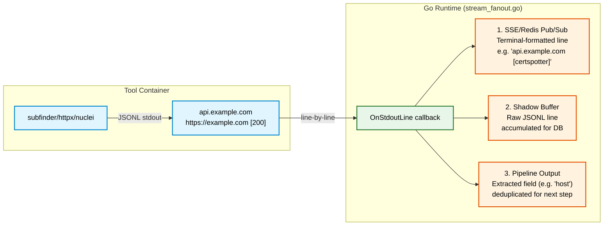

### `ClassFileOnly` — Post-Run File Capture

**Tools**: nmap, masscan, gobuster (with -oX), etc.

**Configuration**: `shadow_output_config.formats[preferred].transport == "file"`

**Behavior**:

- Tool writes structured output to a file (e.g. `-oX report.xml`)
- Stdout emits human-readable log lines
- After container exits, Go reads the shadow file from the bind-mounted host path

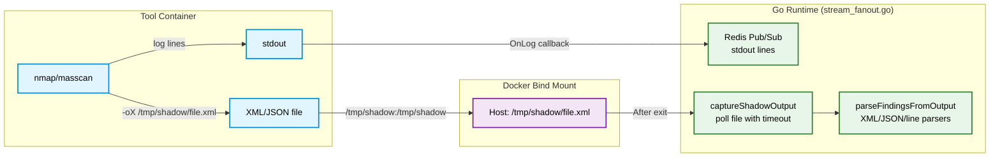

---

## Real-Time Log Streaming (Fan-Out)

### `publishLog` (`logging.go`)

Every significant event during scan execution publishes a log chunk to Redis Pub/Sub:

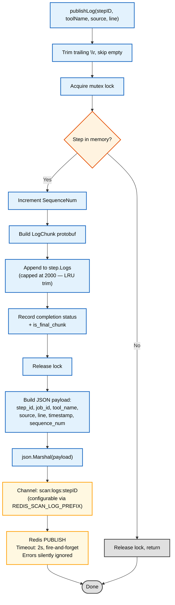

### Log Sources

| Source              | When Published                                                                      |
| ------------------- | ----------------------------------------------------------------------------------- |
| `LOG_SOURCE_SYSTEM` | Step queued, starting, container launch, shadow capture, completion, errors, panics |
| `LOG_SOURCE_STDOUT` | Each line from Docker container stdout                                              |
| `LOG_SOURCE_STDERR` | Each line from Docker container stderr                                              |

### Fan-Out for JSONL Tools (`stream_fanout.go`)

When a tool is `ClassStdoutJSONL`, each stdout line is fanned out to three targets:

1. **SSE/Redis Pub/Sub**: Terminal-formatted line for human viewing
   - Primary value (e.g. `api.example.com`) followed by bracket annotations
   - Example: `https://apply.cadt.edu.kh [200] [Bootstrap:5,jQuery:3.6]`
2. **Shadow Buffer**: Raw JSONL line accumulated for DB persistence
3. **Pipeline Output**: Extracted field value (e.g. `host`) deduplicated for next step

### Client Consumption

External systems (e.g. a WebSocket gateway) subscribe to `scan:logs:*` channels and forward messages to connected clients in real time:

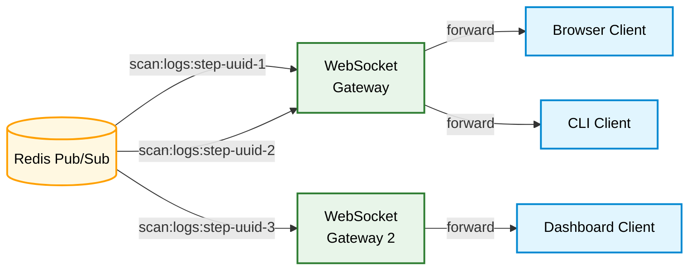

---

## Pipeline Transport (Inter-Step Piping)

### How Output Flows Between Steps

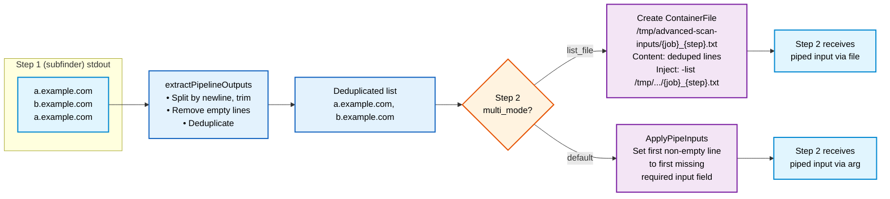

### Pipeline Modes

| Mode        | When to Use                            | Behavior                                                             |
| ----------- | -------------------------------------- | -------------------------------------------------------------------- |
| `list_file` | Tool accepts a file of targets         | Writes all piped lines to a container file, injects via `-list` flag |
| `default`   | Tool accepts a single target at a time | Takes first non-empty line, fills first missing required input field |

### Key Design Decisions

- **list_file mode**: Writes all piped lines to a file injected directly into the container (no host-side I/O).
- **Deduplication**: Happens both on extraction (output) and normalization (input).
- **Empty handling**: Blank lines and whitespace-only lines are silently dropped.

### JSONL Pipeline Extraction

For `ClassStdoutJSONL` tools, the pipeline output is extracted from JSON stdout:

1. Read `output_schema.pipeline_output.extract_field` (e.g. `"host"`)
2. For each JSON line, extract the field value
3. Fallback to common aliases: `host`, `url`, `input`, `ip`, `domain`
4. Deduplicate extracted values
5. Pass to next step

---

## Shadow Output Capture

Shadow output allows capturing **structured tool output** (e.g. nmap XML, JSON) alongside raw stdout.

### Configuration (tool's `shadow_output_config` JSON)

```json
{
  "preferred_format": "xml",
  "formats": {
    "xml": {
      "transport": "file",
      "path_flag": "-oX",
      "parser": "xml",
      "path_mode": "file",
      "file_extension": ".xml"
    }
  },
  "default_path": "/tmp/shadow",
  "fallback_to_stdout": true
}
```

### Flow

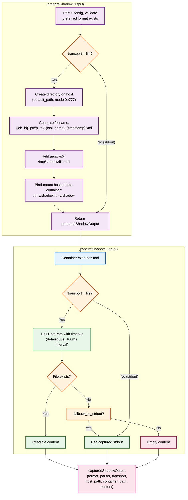

---

## Result Persistence & Finding Extraction

### `persistStepResult` (`persistence.go`)

After each step completes, results are persisted in two layers:

#### Layer 1: Raw Scan Result

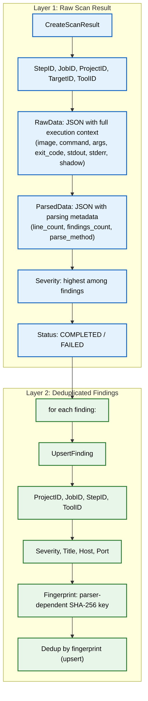

### JSONL Shadow Persistence (`persistJSONLShadow`)

For `ClassStdoutJSONL` tools, persistence is streamlined:

1. **Raw Data**: All accumulated JSONL lines stored as-is
2. **Parsed Data**: Line count and parse metadata
3. **Findings**: Each JSONL line parsed as a finding (JSON object fields → title, host, port, severity)

### Finding Parsers (in order of attempt)

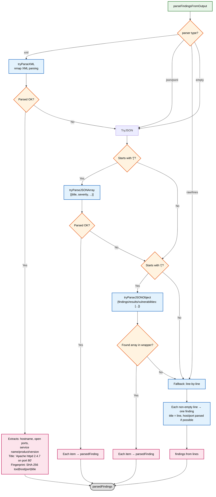

### Severity Normalization

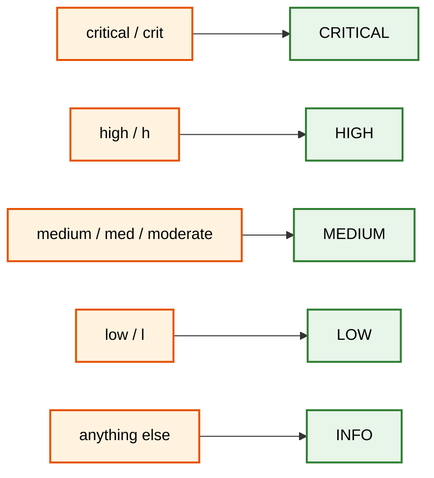

Note: `persistStepResult` is only called for executed steps. Steps marked `SKIPPED` are not written to `scan_results`.

---

## Idempotency Mechanism

### Purpose

Prevent duplicate scan submissions when clients retry (network issues, timeouts).

### How It Works

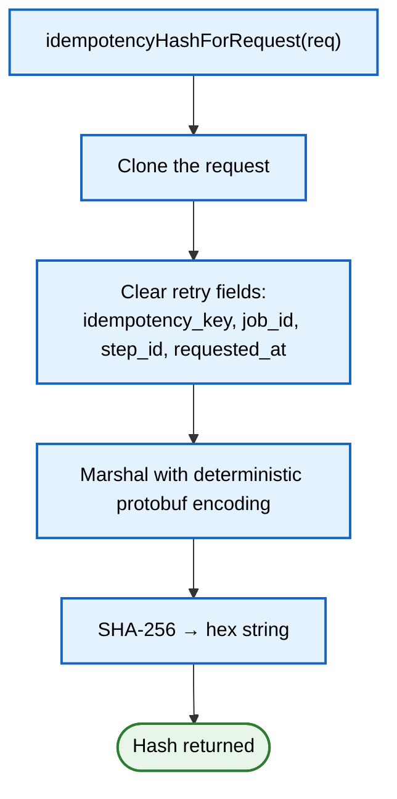

### Cache Behavior

| Scenario                                  | Response                                                                                      |
| ----------------------------------------- | --------------------------------------------------------------------------------------------- |
| Key not found                             | Register, proceed normally                                                                    |
| Key found + hash matches + response ready | Replay cached response, `IsIdempotentReplay=true`, `OriginalRequestId=original first step_id` |
| Key found + hash matches + still running  | Return `Aborted` — retry shortly                                                              |
| Key found + hash differs                  | Return `AlreadyExists` — key reused with different payload                                    |
| TTL (24h) expired                         | Entry auto-removed by background cleanup                                                      |

---

## Policy & Security Deny List

### Policy Validation Flow

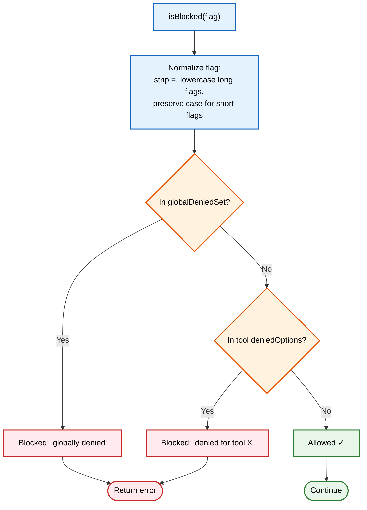

### Global Denied Flags (blocked for ALL tools)

```
Interactive:  -it, --interactive, --tty, -t, -i
Code exec:    --eval, --execute, --run, -e
Output redirect: --output, -o, --log, --logfile, --log-file
Debug/proxy:  --debug, --trace, --proxy, --upstream-proxy
```

### Per-Tool Denied Flags

Additional flags blocked per tool (stored in `tools.denied_options` column).

### Validation Flow

```
isBlocked(flag):
  1. Normalize flag (strip =, lowercase long flags, preserve case for short flags)
  2. Check globalDeniedSet
  3. Check tool-specific denied set
  4. If blocked → return error with reason ("globally denied" or "denied for tool X")
```

### Applied To

- Custom flags from user request
- Input schema field flags
- Scan config option flags

### Safe Flag Pattern

Custom flags must match: `^--?[A-Za-z0-9][A-Za-z0-9._-]*$`

---

## Runtime Configuration (gVisor / Network / Capabilities)

### Resolution Order

```mermaid
flowchart TD
    classDef default_node fill:#e3f2fd,stroke:#1565c0,stroke-width:2px,color:#000
    classDef decision fill:#fff3e0,stroke:#e65100,stroke-width:2px,color:#000
    classDef blocked fill:#ffebee,stroke:#c62828,stroke-width:2px,color:#000
    classDef success fill:#e8f5e9,stroke:#2e7d32,stroke-width:2px,color:#000

    subgraph GVisor ["useGVisor"]
        G1["Default: true"]:::default_node --> G2{"scanConfig.runtime.use_gvisor set?"}:::decision
        G2 -->|"Yes"| G3["Override with per-tool value"]:::default_node
        G2 -->|"No"| G4["Keep default: true"]:::success
    end

    subgraph Network ["networkMode"]
        N1{"executionConfig.network_policy.mode set?"}:::decision -->|"Yes"| N2["WINS — per-request"]:::success
        N1 -->|"No"| N3{"scanConfig.runtime.network_mode set?"}:::decision
        N3 -->|"Yes"| N4["Fallback — per-tool"]:::default_node
        N3 -->|"No"| N5["Default: bridge"]:::success
    end

    subgraph Privileged ["privileged"]
        P1["Default: false"]:::default_node --> P2{"scanConfig.runtime.privileged set?"}:::decision
        P2 -->|"Yes, true"| P3["BLOCKED: privileged forbidden"]:::blocked
        P2 -->|"No"| P4["Keep default: false"]:::success
    end

    subgraph Capabilities ["capAdd"]
        C1["scanConfig.runtime.cap_add"]:::default_node --> C2["Normalize: uppercase, strip CAP_ prefix"]:::default_node
        C2 --> C3{"In allowedRuntimeCapabilities?"}:::decision
        C3 -->|"Yes"| C4["Add to capAdd list"]:::success
        C3 -->|"No"| C5["BLOCKED: capability forbidden"]:::blocked
    end
```

### Allowed Runtime Capabilities

Only `NET_RAW` is permitted. All other capabilities are forbidden.

### Docker RunConfig

```
ToolConfig {
    Image:           plan.ImageRef
    Command:         plan.Command
    Args:            plan.Args
    Files:           pipelineFiles (injected list files)
    Volumes:         preparedShadow.Volumes (shadow output mounts)
    ImagePullPolicy: imagePullPolicyFromSource(source)  ← "custom"/"local"=never, else=if-missing
    Timeout:         request timeout or 5min default
    UseGVisor:       resolved
    NetworkMode:     resolved
    Privileged:      false (always forbidden)
    CapAdd:          resolved (only NET_RAW allowed)
    MemoryLimit:     from request resource limits
    CPUQuota:        from request resource limits
    OnLog:           callback → publishLog()
}
```

### Security Constraints

| Constraint      | Policy                                          |
| --------------- | ----------------------------------------------- |
| Host networking | **Forbidden** — returns error                   |
| Privileged mode | **Forbidden** — returns error                   |
| Capabilities    | **Allowlist** — only `NET_RAW`                  |
| gVisor runtime  | **Default: enabled** (can be disabled per-tool) |
| Network mode    | **Default: bridge** (can be overridden)         |

---

## Status Tracking & Job Lifecycle

### Step Status Transitions

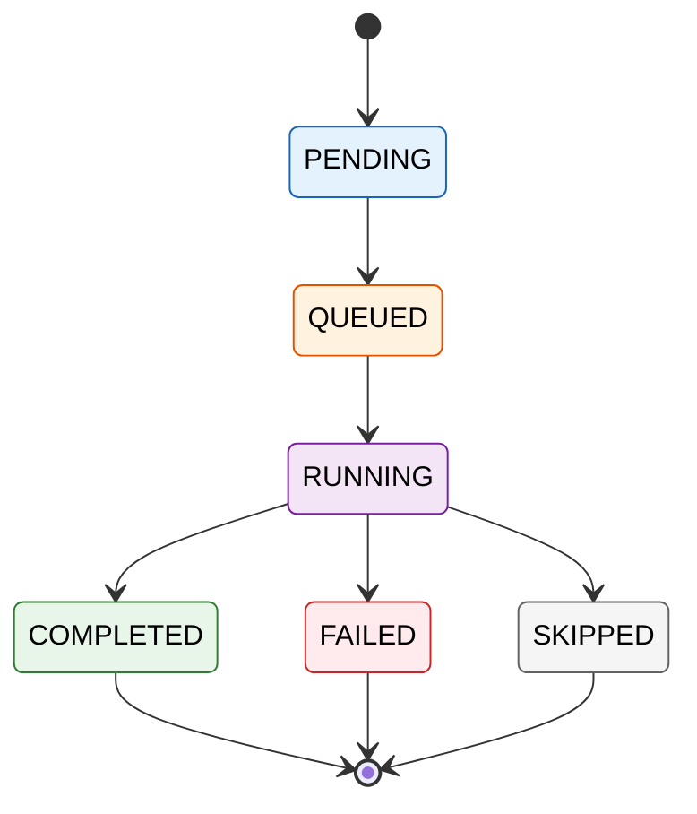

`QUEUED` is maintained in the in-memory/runtime view and returned by `SubmitScan` / runtime snapshots. When status is synced to the DB, `QUEUED` is stored as `pending`. There is currently no active cancellation path in this module.

### Job Status Derivation

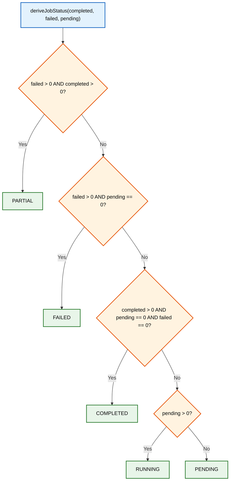

### Dual-Source Status Queries

`GetStepStatus` and `GetJobStatus` use a **dual-source strategy**:

```mermaid
flowchart TD
    classDef process fill:#e3f2fd,stroke:#1565c0,stroke-width:2px,color:#000
    classDef decision fill:#fff3e0,stroke:#e65100,stroke-width:2px,color:#000
    classDef realtime fill:#f3e5f5,stroke:#7b1fa2,stroke-width:2px,color:#000
    classDef persistent fill:#e8f5e9,stroke:#2e7d32,stroke-width:2px,color:#000
    classDef endnode fill:#e0e0e0,stroke:#424242,stroke-width:2px,color:#000

    Start["GetStepStatus / GetJobStatus"]:::process --> CheckMem{"In-memory runtime state?"}:::decision
    CheckMem -->|"Found"| Snapshot["Return runtime snapshot<br/>Real-time status for active scans"]:::realtime
    CheckMem -->|"Not found"| DBQuery["Query database<br/>scan_steps + scan_results"]:::persistent
    DBQuery --> Persistent["Return persistent status<br/>Completed scans / after restart"]:::persistent
    Snapshot --> Done([Response]):::endnode
    Persistent --> Done
```

### DB Sync Strategy

- **markStepRunning**: Sync immediately (fire-and-forget, error logged but doesn't block)
- **Terminal status**: Sync on step completion/failure
- **Job status**: Sync on every step status change via `syncJobStatusToDB`

When syncing job state to PostgreSQL, protobuf-only states such as `PARTIAL` and `CANCELLED` currently collapse to `failed` because the DB enum does not include those values.

---

## Background Cleanup

Runs every **5 minutes** via `startBackgroundCleanup`:

```mermaid
flowchart TD
    classDef start fill:#e8f5e9,stroke:#2e7d32,stroke-width:2px,color:#000
    classDef process fill:#e3f2fd,stroke:#1565c0,stroke-width:2px,color:#000
    classDef decision fill:#fff3e0,stroke:#e65100,stroke-width:2px,color:#000
    classDef delete fill:#ffebee,stroke:#c62828,stroke-width:2px,color:#000
    classDef endnode fill:#e0e0e0,stroke:#424242,stroke-width:2px,color:#000

    Start(["Ticker: every 5 minutes"]):::start --> Loop1["For each idempotency entry"]:::process
    Loop1 --> AgeCheck{"age > 24h?"}:::decision
    AgeCheck -->|"Yes"| DelIdem["Delete entry"]:::delete
    AgeCheck -->|"No"| Loop2

    DelIdem --> Loop2["For each job"]:::process
    Loop2 --> TermCheck{"Terminal status AND<br/>finished > 1h ago?"}:::decision
    TermCheck -->|"Yes"| DelJob["Delete job from memory"]:::delete
    TermCheck -->|"No"| Loop3

    DelJob --> Loop3["For each step"]:::process
    Loop3 --> TermCheck2{"Terminal status AND<br/>finished > 1h ago?"}:::decision
    TermCheck2 -->|"Yes"| DelStep["Delete step from memory"]:::delete
    TermCheck2 -->|"No"| End([Done]):::endnode

    DelStep --> End
```

This prevents unbounded memory growth for long-running server instances. Note: DB records are **never** cleaned up by this process — they are permanent.

---

## End-to-End Sequence Diagram

```mermaid
sequenceDiagram
    autonumber
    participant Client
    participant Server as advancedScanServer
    participant Queue as Redis Queue
    participant Worker as Queue Worker
    participant DB as PostgreSQL
    participant Redis as Redis Pub/Sub
    participant Docker

    Client->>Server: SubmitScan
    Server->>DB: parseUnixCommand (resolve tools)
    DB-->>Server: tool configs
    Server->>Server: idempotencyHash + check cache
    Server->>DB: CREATE target (if needed)
    Server->>DB: INSERT scan_job
    Server->>DB: INSERT scan_steps (×N)
    Server->>Queue: EnqueueWithCapacityCheck

    alt Queue Full
        Server-->>Client: SubmitScanResponse (status=QUEUE_FULL)
    else Enqueued
        Server-->>Client: SubmitScanResponse (status=QUEUED)

        Note over Queue,Worker: Background execution
        Queue->>Worker: Dequeue job
        Worker->>DB: Re-resolve tools
        Worker->>Worker: Reconstruct chain spec
        Worker->>Worker: executeStepChain

        loop For each step
            Worker->>DB: UPDATE step → RUNNING
            Worker->>Worker: preparePipelineInput
            Worker->>Worker: buildAdvancedInvocation
            Worker->>Worker: prepareShadowOutput

            alt ClassStdoutJSONL
                Worker->>Docker: Run container (streamed)
                Docker-->>Worker: OnStdoutLine (real-time)
                Worker->>Redis: PUBLISH fan-out (SSE + shadow + pipe)
            else ClassFileOnly
                Worker->>Docker: Run container (standard)
                Docker-->>Worker: OnLog (stdout/stderr)
                Worker->>Redis: PUBLISH log lines
                Worker->>Worker: captureShadowOutput (post-run)
            end

            Worker->>Worker: writeShadowArtifact
            Worker->>DB: INSERT scan_result
            Worker->>DB: UPSERT findings
            Worker->>DB: UPDATE step status
            Worker->>DB: UPDATE job status
            Worker->>Worker: extractPipelineOutputs
        end

        Worker->>Queue: Complete(receipt)
    end

    Client->>Server: GetJobStatus
    Server->>Server: runtimeJobStatusSnapshot
    Server-->>Client: JobStatusResponse

    Client->>Server: GetResults
    Server->>DB: SELECT findings
    Server-->>Client: GetResultsResponse
```

---

## Configuration Environment Variables

| Variable                | Default          | Purpose                                |
| ----------------------- | ---------------- | -------------------------------------- |
| `REDIS_ADDR`            | `localhost:6379` | Redis server address                   |
| `REDIS_SCAN_LOG_PREFIX` | `scan:logs`      | Redis Pub/Sub channel prefix           |
| `SHADOW_OUTPUT_ROOT`    | `/tmp/shadow`    | Default directory for shadow artifacts |
