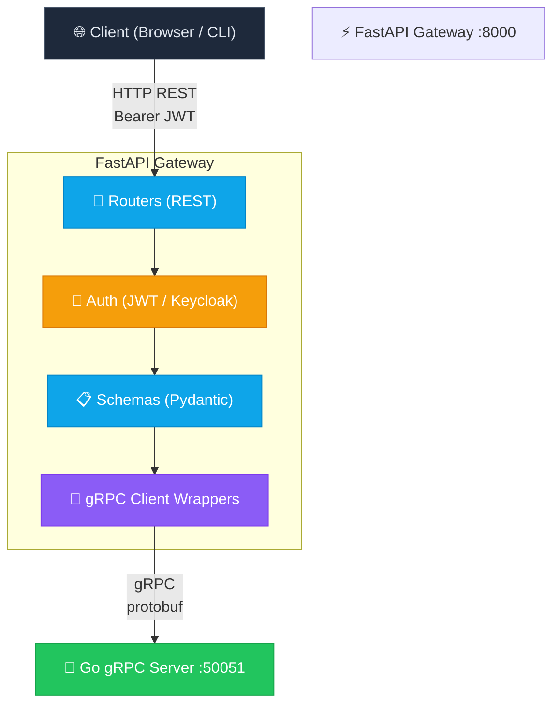
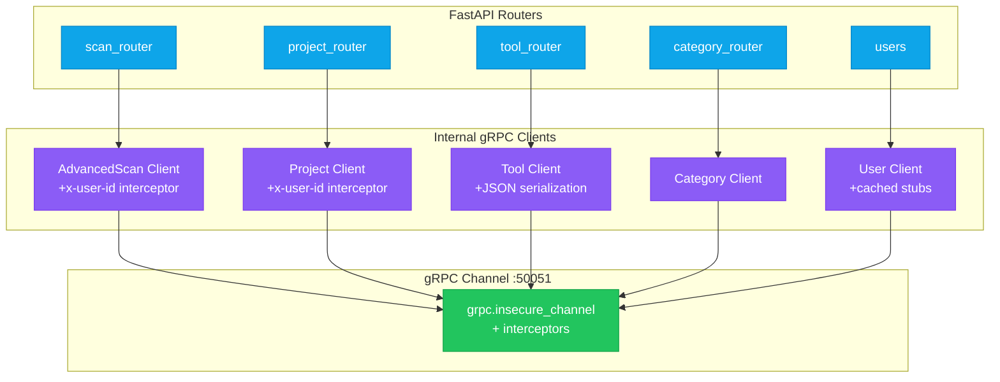

# FastAPI Gateway

Python HTTP API gateway that fronts Go gRPC microservices. Handles authentication, request validation, protocol translation, real-time log streaming, and GitHub OAuth integration.

## Role in the Architecture



The gateway translates HTTP REST requests into gRPC calls, handles JWT authentication, and provides browser-compatible responses (JSON + SSE).

## Tech Stack

| Technology                                            | Purpose                                          |
| ----------------------------------------------------- | ------------------------------------------------ |
| [FastAPI](https://fastapi.tiangolo.com/)              | HTTP API framework with automatic OpenAPI docs   |
| [uvicorn](https://www.uvicorn.org/)                   | ASGI server                                      |
| [Pydantic v2](https://docs.pydantic.dev/)             | Request/response validation                      |
| [gRPC Python](https://grpc.io/docs/languages/python/) | Client stubs for Go microservices                |
| [PyJWT](https://pyjwt.readthedocs.io/)                | JWT verification with Keycloak JWKS              |
| [Redis](https://redis.io/)                            | Pub/sub for SSE log streaming                    |
| [httpx](https://www.python-httpx.org/)                | Async HTTP client (GitHub OAuth, Keycloak admin) |
| [uv](https://docs.astral.sh/uv/)                      | Package manager and dependency resolver          |

## Quick Start

```bash
# Install dependencies and run
uv sync
uv run uvicorn main:app --reload --host 0.0.0.0 --port 8000
```

Or with Docker:

```bash
docker compose up fastapi-gateway --build
```

API docs available at `http://localhost:8000/docs`.

## Configuration

Loads `.env` always, then `.env.prod` for production or `.env.dev` otherwise.

### Keycloak Authentication

| Variable                       | Default                                                     | Description                                                         |
| ------------------------------ | ----------------------------------------------------------- | ------------------------------------------------------------------- |
| `KEYCLOAK_ISSUER`              |                                                             | Keycloak realm URL (e.g. `https://auth.example.com/realms/myrealm`) |
| `KEYCLOAK_AUDIENCE`            |                                                             | Comma-separated list of expected `aud`/`azp` values                 |
| `KEYCLOAK_JWKS_URL`            | Auto-derived from issuer + `/protocol/openid-connect/certs` | JWKS endpoint for JWT verification                                  |
| `KEYCLOAK_WEB_CLIENT_ID`       | `platform-web`                                              | Client ID for web frontend tokens                                   |
| `KEYCLOAK_WEB_CLIENT_IDS`      | Falls back to `KEYCLOAK_WEB_CLIENT_ID`                      | Comma-separated list of valid web client IDs                        |
| `KEYCLOAK_CLI_CLIENT_ID`       | `cli-client`                                                | Client ID for CLI tokens                                            |
| `KEYCLOAK_CI_CLIENT_PREFIX`    | `ci-`                                                       | Prefix for CI/service token client IDs                              |
| `KEYCLOAK_ADMIN_CLIENT_ID`     | Falls back to web client ID                                 | Admin client for Keycloak REST API                                  |
| `KEYCLOAK_ADMIN_CLIENT_SECRET` | Falls back to web client secret                             | Admin client secret                                                 |
| `KEYCLOAK_ADMIN_TOKEN`         |                                                             | Static admin token (alternative to client credentials)              |

### GitHub OAuth Integration

| Variable                     | Default                                              | Description                      |
| ---------------------------- | ---------------------------------------------------- | -------------------------------- |
| `GITHUB_OAUTH_CLIENT_ID`     |                                                      | GitHub OAuth app client ID       |
| `GITHUB_OAUTH_CLIENT_SECRET` |                                                      | GitHub OAuth app client secret   |
| `GITHUB_OAUTH_REDIRECT_URI`  | `http://localhost:8000/integrations/github/callback` | Callback URL                     |
| `GITHUB_OAUTH_SCOPE`         | `read:user user:email repo`                          | Requested scopes                 |
| `GITHUB_OAUTH_STATE_SECRET`  | Falls back to Keycloak admin secret                  | HMAC key for OAuth state signing |

### Infrastructure

| Variable           | Default                    | Description                   |
| ------------------ | -------------------------- | ----------------------------- |
| `GRPC_SERVER_ADDR` | `localhost:50051`          | Address of the Go gRPC server |
| `REDIS_URL`        | `redis://localhost:6379/0` | Redis URL for log streaming   |
| `ENVIRONMENT`      | `development`              | `development` or `production` |

## Authentication Flow

All routes (except `/health` and the GitHub OAuth callback) require a valid Keycloak JWT.

### Token Verification

1. Extract `Authorization: Bearer <token>` header
2. Decode JWT payload and verify signature against Keycloak JWKS (RS256/RS384/RS512)
3. Verify issuer matches `KEYCLOAK_ISSUER`
4. Verify `aud` or `azp` claim intersects with configured audiences
5. Extract `user_id` from `sub`, `user_id`, or `uid` claims
6. Check user exists in the Go core service via gRPC

### Actor Type Classification

Based on the `azp` (authorized party) claim, callers are classified:

| Actor Type | How Determined                                | Used By               |
| ---------- | --------------------------------------------- | --------------------- |
| `web_user` | `azp` in `KEYCLOAK_WEB_CLIENT_IDS`            | Web frontend routes   |
| `cli_user` | `azp` == `KEYCLOAK_CLI_CLIENT_ID`             | CLI tool routes       |
| `service`  | `azp` starts with `KEYCLOAK_CI_CLIENT_PREFIX` | CI/CD pipeline routes |

### Role-Based Access

Routes use dependency injection to enforce permissions:

- `require_web_user` — only web frontend tokens
- `require_cli_user` — only CLI tokens
- `require_scan_permission` — requires `user:scan:run` role for web/CLI or `pipeline:scan` for services

## Endpoints

### Health

| Method | Path      | Auth | Response           |
| ------ | --------- | ---- | ------------------ |
| GET    | `/health` | None | `{"status": "ok"}` |

### Authentication

| Method | Path       | Auth                   | Description                                               |
| ------ | ---------- | ---------------------- | --------------------------------------------------------- |
| GET    | `/auth/me` | Any authenticated user | Returns `user_id`, `azp`, `actor_type`, `roles`, `scopes` |

### Projects

All routes require `get_current_user` (any authenticated user).

| Method | Path                     | Description                        |
| ------ | ------------------------ | ---------------------------------- |
| POST   | `/projects`              | Create a new project               |
| GET    | `/projects`              | List all projects for current user |
| GET    | `/projects/{project_id}` | Get project by ID                  |
| PATCH  | `/projects/{project_id}` | Update project (partial)           |
| DELETE | `/projects/{project_id}` | Delete project (204)               |

### Tools

All routes require `require_web_user` (web frontend only).

| Method | Path                        | Description                                                                                      |
| ------ | --------------------------- | ------------------------------------------------------------------------------------------------ |
| POST   | `/tools`                    | Create a tool (with full `input_schema`, `output_schema`, `scan_config`, `shadow_output_config`) |
| GET    | `/tools`                    | List tools (query params: `active_only`, `category_name`)                                        |
| GET    | `/tools/{tool_id}`          | Get tool by ID                                                                                   |
| PUT    | `/tools/{tool_id}`          | Update tool (partial)                                                                            |
| DELETE | `/tools/{tool_id}`          | Soft-delete a tool                                                                               |
| PATCH  | `/tools/{tool_id}/activate` | Reactivate a tool                                                                                |

### Categories

All routes require `require_web_user`.

| Method | Path                        | Description             |
| ------ | --------------------------- | ----------------------- |
| POST   | `/categories`               | Create a category (201) |
| GET    | `/categories`               | List all categories     |
| GET    | `/categories/{category_id}` | Get category by ID      |
| PUT    | `/categories/{category_id}` | Update a category       |
| DELETE | `/categories/{category_id}` | Hard-delete a category  |

### Advanced Scans

All routes require `get_current_user`.

| Method | Path                                           | Description                                                                                 |
| ------ | ---------------------------------------------- | ------------------------------------------------------------------------------------------- |
| POST   | `/scans/advanced/submit`                       | Submit scan command, returns `job_id`, `step_id`, `status`, `retry_after_seconds`           |
| GET    | `/scans/advanced/steps/{step_id}`              | Get step status                                                                             |
| GET    | `/scans/advanced/jobs/{job_id}`                | Get job status with step summaries                                                          |
| GET    | `/scans/advanced/results`                      | Get paginated findings with filters                                                         |
| GET    | `/scans/advanced/jobs/{job_id}/findings`       | Get findings for a job                                                                      |
| GET    | `/scans/advanced/steps/{step_id}/findings`     | Get findings for a step                                                                     |
| GET    | `/scans/advanced/jobs/{job_id}/summary`        | Get job summary with severity counts, unique hosts/ports                                    |
| GET    | `/scans/advanced/steps/{step_id}/summary`      | Get step summary                                                                            |
| GET    | `/scans/advanced/steps/{step_id}/raw-output`   | Get raw tool output (base64 inline or S3 URL)                                               |
| GET    | `/scans/advanced/steps/{step_id}/logs/stream`  | **Stream logs via SSE** (EventSource)                                                       |
| GET    | `/scans/advanced/queue/status`                 | Get queue status (`queued_jobs`, `processing_jobs`, `max_concurrent`, `max_queue_capacity`) |
| GET    | `/scans/advanced/queue/jobs/{job_id}/position` | Get job position in queue                                                                   |
| POST   | `/scans/advanced/queue/jobs/{job_id}/cancel`   | Cancel a queued job                                                                         |

### Users

All routes require `require_web_user`.

| Method | Path               | Description                                                                |
| ------ | ------------------ | -------------------------------------------------------------------------- |
| POST   | `/users`           | Create user (Keycloak + gRPC core, with rollback on failure)               |
| GET    | `/users`           | List all users                                                             |
| GET    | `/users/{user_id}` | Get user by ID                                                             |
| PATCH  | `/users/{user_id}` | Update user (partial: `username`, `email`, `alias_name`, `avatar_profile`) |
| DELETE | `/users/{user_id}` | Delete user (gRPC core first, then best-effort Keycloak cleanup)           |

### GitHub Integration

| Method | Path                               | Auth               | Description                                                                 |
| ------ | ---------------------------------- | ------------------ | --------------------------------------------------------------------------- |
| GET    | `/integrations/github/connect-url` | `require_web_user` | Generate signed OAuth authorize URL                                         |
| GET    | `/integrations/github/callback`    | None               | OAuth callback — exchanges code for token, fetches profile, upserts to gRPC |
| GET    | `/integrations/github/accounts`    | `require_web_user` | List linked GitHub accounts                                                 |

## Internal Architecture

### gRPC Client Wrappers

The gateway uses five internal client modules to communicate with the Go server:



| Client                 | gRPC Service          | Special Behavior                                                         |
| ---------------------- | --------------------- | ------------------------------------------------------------------------ |
| `advanced_scan_client` | `AdvancedScanService` | Attaches `x-user-id` metadata to every call via interceptor              |
| `project_client`       | `ProjectService`      | Same `x-user-id` interceptor                                             |
| `tool_client`          | `ToolService`         | Serializes `ScanConfig`/`ShadowOutputConfig` JSON for protobuf transport |
| `category_client`      | `CategoryService`     | No metadata injection                                                    |
| `user_client`          | `UserService`         | Cached stub (LRU max 4), GitHub provider account upsert                  |

### gRPC Error Mapping

All gRPC errors are caught and translated to HTTP status codes:

| gRPC Status                               | HTTP Status |
| ----------------------------------------- | ----------- |
| `INVALID_ARGUMENT`, `FAILED_PRECONDITION` | 400         |
| `UNAUTHENTICATED`                         | 401         |
| `PERMISSION_DENIED`                       | 403         |
| `NOT_FOUND`                               | 404         |
| `ALREADY_EXISTS`                          | 409         |
| `RESOURCE_EXHAUSTED`                      | 429         |
| `UNIMPLEMENTED`                           | 501         |
| `UNAVAILABLE`                             | 503         |
| `DEADLINE_EXCEEDED`                       | 504         |
| (default)                                 | 500         |

### Real-Time Log Streaming (SSE)

The `/scans/advanced/steps/{step_id}/logs/stream` endpoint uses Redis pub/sub:

1. FastAPI subscribes to Redis channel `scan:logs:{step_id}`
2. Each incoming pub/sub message is formatted as an SSE event: `data: {payload}\n\n`
3. A heartbeat is sent every 15 seconds to keep the connection alive
4. Errors are emitted as `event: error` SSE events
5. The client (browser) uses the native `EventSource` API

```
Go Server ──publish──▶ Redis Pub/Sub (scan:logs:{step_id})
                            │
                       subscribe
                            │
                            ▼
                      FastAPI Gateway
                            │
                      SSE stream
                            │
                            ▼
                       Browser (EventSource)
```

### User Lifecycle with Rollback

The `POST /users` endpoint has two-phase creation with rollback:

1. Create user in Keycloak via Admin REST API (gets Keycloak `user_id`)
2. Create user in Go core via gRPC `CreateUser`
3. If gRPC fails → delete the Keycloak user (rollback)
4. If both succeed → return the created user

Similarly, `DELETE /users/{user_id}` deletes from gRPC first, then does a best-effort delete from Keycloak.

### GitHub OAuth Integration

Full Authorization Code flow:

1. Client requests `/integrations/github/connect-url`
2. Gateway generates an HMAC-signed `state` parameter containing `user_id` and a timestamp
3. Client is redirected to GitHub OAuth
4. GitHub redirects back to `/integrations/github/callback?code=...&state=...`
5. Gateway validates the HMAC signature on `state`
6. Exchanges `code` for access token at GitHub's token URL
7. Fetches user profile from `api.github.com/user`
8. Fetches verified email from `api.github.com/user/emails` (if not on profile)
9. Calls `user_client.upsert_github_provider_account` via gRPC
10. Redirects to success/error URL based on outcome

## Project Structure

```
fastapi-gateway/
├── main.py                          # App entry point, CORS, router registration, /health
├── pyproject.toml                   # Dependencies (uv-managed)
├── Dockerfile                       # python:3.13-slim + uv
│
├── app/
│   ├── core/
│   │   ├── config.py                # Settings (pydantic), env loading, singleton via @lru_cache
│   │   └── security.py              # JWT verification (JWKS, RS256/384/512, audience check)
│   │
│   ├── dependencies/
│   │   └── auth.py                  # CurrentUser dataclass, get_current_user, role-based deps
│   │
│   ├── routers/
│   │   ├── scan_router.py           # Advanced scan endpoints + SSE log streaming
│   │   ├── tool_router.py           # Tool CRUD + activate
│   │   ├── project_router.py        # Project CRUD
│   │   ├── category_router.py       # Category CRUD
│   │   ├── users.py                 # User CRUD with Keycloak + rollback
│   │   ├── auth.py                  # /auth/me
│   │   └── integrations_git_account.py  # GitHub OAuth flow
│   │
│   ├── internal/
│   │   ├── advanced_scan_client.py  # gRPC AdvancedScanService wrapper + x-user-id interceptor
│   │   ├── project_client.py        # gRPC ProjectService wrapper + x-user-id interceptor
│   │   ├── tool_client.py           # gRPC ToolService wrapper + JSON serialization
│   │   ├── category_client.py       # gRPC CategoryService wrapper
│   │   ├── grpc/
│   │   │   └── user_client.py       # gRPC UserService wrapper + cached stubs
│   │   └── keycloak/
│   │       └── admin_client.py      # Keycloak Admin REST API (HTTPX)
│   │
│   ├── schemas/
│   │   ├── advanced_scan_schemas.py   # Scan submit/status/results/queue Pydantic models
│   │   ├── tool_schemas.py            # Tool + InputSchema + ScanConfig + ShadowOutput models
│   │   ├── project_schemas.py         # Project CRUD models
│   │   └── category_schemas.py        # Category CRUD models
│   │
│   ├── utils/
│   │   └── grpc_errors.py           # gRPC StatusCode → HTTP status code mapping
│   │
│   └── gen/                         # Generated gRPC Python code from .proto files
│       ├── advanced_scan_pb2.py
│       ├── advanced_scan_pb2_grpc.py
│       └── ...
```

## Development

```bash
# Install dependencies
uv sync

# Run the server with auto-reload
uv run uvicorn main:app --reload --host 0.0.0.0 --port 8000

# Regenerate gRPC code after .proto changes
cd .. && make proto-py

# Open interactive API docs
open http://localhost:8000/docs

# Run with production config
ENVIRONMENT=production uv run uvicorn main:app --host 0.0.0.0 --port 8000
```

## Environment Variables

The gateway loads `.env` always, then `.env.prod` for production or `.env.dev` otherwise.

### Infrastructure

| Variable           | Default                    | Description                   |
| ------------------ | -------------------------- | ----------------------------- |
| `GRPC_SERVER_ADDR` | `localhost:50051`          | Address of the Go gRPC server |
| `REDIS_URL`        | `redis://localhost:6379/0` | Redis URL for log streaming   |
| `ENVIRONMENT`      | `development`              | `development` or `production` |

### Keycloak Authentication

| Variable                       | Default                                                     | Description                                                         |
| ------------------------------ | ----------------------------------------------------------- | ------------------------------------------------------------------- |
| `KEYCLOAK_ISSUER`              |                                                             | Keycloak realm URL (e.g. `https://auth.example.com/realms/myrealm`) |
| `KEYCLOAK_AUDIENCE`            |                                                             | Comma-separated list of expected `aud`/`azp` values                 |
| `KEYCLOAK_JWKS_URL`            | Auto-derived from issuer + `/protocol/openid-connect/certs` | JWKS endpoint for JWT verification                                  |
| `KEYCLOAK_WEB_CLIENT_ID`       | `platform-web`                                              | Client ID for web frontend tokens                                   |
| `KEYCLOAK_WEB_CLIENT_IDS`      | Falls back to `KEYCLOAK_WEB_CLIENT_ID`                      | Comma-separated list of valid web client IDs                        |
| `KEYCLOAK_CLI_CLIENT_ID`       | `cli-client`                                                | Client ID for CLI tokens                                            |
| `KEYCLOAK_CI_CLIENT_PREFIX`    | `ci-`                                                       | Prefix for CI/service token client IDs                              |
| `KEYCLOAK_ADMIN_CLIENT_ID`     | Falls back to web client ID                                 | Admin client for Keycloak REST API                                  |
| `KEYCLOAK_ADMIN_CLIENT_SECRET` | Falls back to web client secret                             | Admin client secret                                                 |
| `KEYCLOAK_ADMIN_TOKEN`         |                                                             | Static admin token (alternative to client credentials)              |

### GitHub OAuth Integration

| Variable                     | Default                                              | Description                      |
| ---------------------------- | ---------------------------------------------------- | -------------------------------- |
| `GITHUB_OAUTH_CLIENT_ID`     |                                                      | GitHub OAuth app client ID       |
| `GITHUB_OAUTH_CLIENT_SECRET` |                                                      | GitHub OAuth app client secret   |
| `GITHUB_OAUTH_REDIRECT_URI`  | `http://localhost:8000/integrations/github/callback` | Callback URL                     |
| `GITHUB_OAUTH_SCOPE`         | `read:user user:email repo`                          | Requested scopes                 |
| `GITHUB_OAUTH_STATE_SECRET`  | Falls back to Keycloak admin secret                  | HMAC key for OAuth state signing |

## Production Deployment

When deploying to production:

1. Set `ENVIRONMENT=production` to load `.env.prod` configuration
2. Ensure `KEYCLOAK_JWKS_URL` points to your production Keycloak instance
3. Configure `KEYCLOAK_AUDIENCE` with your production client IDs
4. Set up GitHub OAuth credentials for production
5. Ensure Redis and PostgreSQL are accessible and properly configured
6. Consider increasing worker pool size if handling high concurrency

## Testing

```bash
# Run tests (if available)
pytest

# Check code formatting
black --check .

# Lint with ruff
ruff check .
```

## Troubleshooting

### Common Issues

**gRPC connection refused**: Ensure the Go server is running and accessible at `GRPC_SERVER_ADDR`

**JWT verification failed**: Check that `KEYCLOAK_ISSUER` and `KEYCLOAK_JWKS_URL` are correct and the token is valid

**SSE stream not working**: Verify Redis is running and accessible at `REDIS_URL`

**GitHub OAuth callback failed**: Ensure `GITHUB_OAUTH_REDIRECT_URI` matches your GitHub OAuth app configuration
