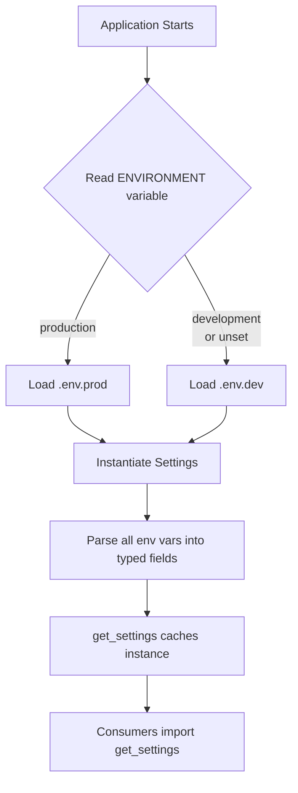
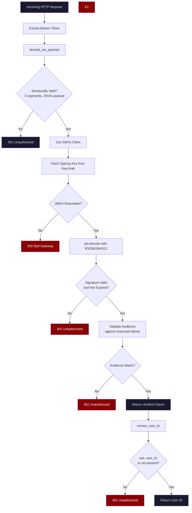
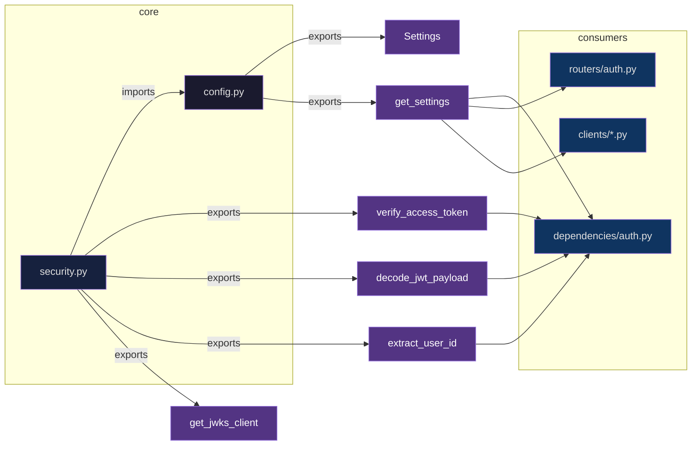

# Core Module

## Overview

The `core` module is the foundational configuration and security layer for the FastAPI gateway. It provides centralized application settings loaded from environment variables and handles JWT token verification against Keycloak. All other modules in the gateway depend on `core` for configuration and identity verification.

## What It Does

The module is organized into two primary responsibilities:

### 1. Configuration Management (`config.py`)

Loads and exposes all application settings from environment variables through a single `Settings` class. It handles multi-environment `.env` file loading, type parsing, and provides a cached singleton accessor.

### 2. JWT Token Verification (`security.py`)

Validates JWT access tokens issued by Keycloak by fetching signing keys from JWKS, verifying signatures, validating audience claims, and extracting user identity. It provides structured error handling with appropriate HTTP status codes for each failure mode.

## Why We Need It

- **Single Source of Truth** -- All configuration (Keycloak, OAuth providers, gRPC, Redis, database, scanning tools) lives in one place. Consumers import `get_settings()` instead of scattering `os.environ` lookups across the codebase.
- **Environment Isolation** -- Automatically loads `.env.dev` or `.env.prod` based on the `ENVIRONMENT` variable, ensuring correct configuration per deployment target.
- **Secure Token Verification** -- Cryptographically verifies JWT signatures using Keycloak's public signing keys, preventing token forgery and unauthorized access.
- **Centralized Error Handling** -- Maps specific failure modes to precise HTTP status codes (401, 500, 502), giving consumers consistent error semantics.

## When It Is Needed

| Scenario | Module Used |
|---|---|
| Application startup -- any component needs configuration | `config.py` (`get_settings()`) |
| Authenticating a JWT Bearer token | `security.py` (`verify_access_token()`) |
| Extracting user identity from token claims | `security.py` (`extract_user_id()`) |
| Fetching Keycloak JWKS signing keys | `security.py` (`get_jwks_client()`) |
| Decoding a JWT payload without signature verification | `security.py` (`decode_jwt_payload()`) |
| Accessing Keycloak, OAuth, gRPC, Redis, or database URLs | `config.py` (`Settings` fields) |

## Architecture

### Configuration Loading Flow



### JWT Verification Flow



### Module Dependency Graph



## Key Components

### Settings Class (`config.py`)

Centralized configuration object populated from environment variables. Organized into logical groups:

#### General

| Field | Default | Description |
|---|---|---|
| `environment` | `"development"` | Runtime environment; controls which `.env` file is loaded |

#### Keycloak (Authentication)

| Field | Default | Description |
|---|---|---|
| `keycloak_issuer` | `None` | Keycloak issuer URL |
| `keycloak_audience` | `None` | Primary audience/client ID |
| `keycloak_audiences` | `[]` | List of accepted audience/client IDs (parsed from CSV env var) |
| `keycloak_jwks_url` | `None` | JWKS endpoint for fetching signing keys |
| `keycloak_admin_client_id` | `None` | Admin client ID for management operations |
| `keycloak_admin_client_secret` | `None` | Admin client secret |
| `keycloak_admin_token` | `None` | Pre-issued admin token (alternative to client credentials) |
| `keycloak_web_client_id` | `None` | Web application client ID |
| `keycloak_web_client_ids` | `[]` | List of web client IDs (parsed from CSV) |
| `keycloak_cli_client_id` | `None` | CLI application client ID |
| `keycloak_ci_client_prefix` | `None` | Prefix for CI client identification |

#### GitHub OAuth

| Field | Default | Description |
|---|---|---|
| `github_client_id` | `None` | GitHub OAuth client ID |
| `github_client_secret` | `None` | GitHub OAuth client secret |
| `github_authorize_url` | `None` | GitHub authorization endpoint |
| `github_token_url` | `None` | GitHub token exchange endpoint |
| `github_api_base_url` | `None` | GitHub API base URL |
| `github_redirect_uri` | `None` | OAuth redirect URI |
| `github_scope` | `None` | Requested OAuth scopes |
| `github_state_secret` | `None` | Secret for CSRF state validation |
| `github_success_redirect` | `None` | Redirect URL after successful login |
| `github_error_redirect` | `None` | Redirect URL after failed login |

#### GitLab OAuth

Same fields as GitHub OAuth, prefixed with `gitlab_`:

`gitlab_client_id`, `gitlab_client_secret`, `gitlab_authorize_url`, `gitlab_token_url`, `gitlab_api_base_url`, `gitlab_redirect_uri`, `gitlab_scope`, `gitlab_state_secret`, `gitlab_success_redirect`, `gitlab_error_redirect`.

#### SonarQube / Security Scanning

| Field | Default | Description |
|---|---|---|
| `sonarqube_host` | `None` | SonarQube server URL |
| `sonarqube_token` | `None` | SonarQube API token |
| `sonar_scanner_bin` | `None` | Path to SonarQube scanner binary |
| `osv_scanner_bin` | `None` | Path to OSV-Scanner binary |
| `osv_scan_timeout_seconds` | `None` | Timeout for OSV scanner executions |
| `sonar_scan_tmp_root` | `None` | Temporary directory root for SonarQube scan artifacts |
| `sonar_scan_timeout_seconds` | `None` | Timeout for SonarQube scan executions |
| `sonar_ce_poll_timeout_seconds` | `None` | Timeout for polling SonarQube Compute Engine task completion |

#### Infrastructure

| Field | Default | Description |
|---|---|---|
| `grpc_server_addr` | `"localhost:50051"` | Core gRPC service address |
| `redis_url` | `"redis://localhost:6379/0"` | Redis connection URL for task queuing |
| `database_url` | `None` | Database connection URL (loaded via `_build_database_url()`) |
| `scan_executor_workers` | `4` | Worker count for concurrent scan execution |
| `scan_stream_poll_interval` | `0.5` | Poll interval (seconds) for scan result streaming |

### Security Functions (`security.py`)

| Function | Signature | Description |
|---|---|---|
| `get_jwks_client` | `(jwks_url: str) -> PyJWKClient` | Returns a cached JWKS client with custom headers and 10s timeout |
| `decode_jwt_payload` | `(token: str) -> dict` | Base64-decodes and parses JWT payload without signature verification |
| `verify_access_token` | `(token: str) -> dict` | Full JWT verification: signature, expiry, audience validation |
| `extract_user_id` | `(claims: dict) -> str` | Extracts user ID from `sub`, `user_id`, or `uid` claims |

### Error Mapping in `verify_access_token()`

| Condition | HTTP Status | Cause |
|---|---|---|
| Missing `cryptography` library | `500` | RS256/384/512 algorithms require the `cryptography` backend |
| JWKS endpoint unreachable | `502` | Network failure fetching Keycloak signing keys |
| Malformed JWT structure | `401` | Token does not have 3 valid segments or invalid base64 |
| Invalid or expired signature | `401` | Token fails cryptographic verification or is past `exp` |
| Audience mismatch | `401` | Token's `aud`/`azp` does not intersect with expected clients |
| No user ID claim | `401` | None of `sub`, `user_id`, `uid` found in claims |

## Usage Examples

### Accessing Settings

```python
from app.core.config import get_settings

settings = get_settings()
print(settings.grpc_server_addr)   # "localhost:50051"
print(settings.keycloak_audiences) # ["web-client", "cli-client"]
```

### Verifying a JWT Token

```python
from app.core.security import verify_access_token, extract_user_id
from fastapi import HTTPException

try:
    claims = verify_access_token(token)
    user_id = extract_user_id(claims)
except HTTPException as e:
    # Handle 401, 500, 502 as appropriate
    pass
```

### Decoding Without Verification (Dev/Testing Only)

```python
from app.core.security import decode_jwt_payload

claims = decode_jwt_payload(token)  # No signature check; for testing only
```

## Module Structure

```
core/
  __init__.py      # Package marker (empty)
  config.py        # Settings class, environment detection, .env loading
  security.py      # JWT verification, JWKS client, user ID extraction
```

## Dependencies

| Internal Dependency | Consumed By |
|---|---|
| `config.py` | `security.py`, `dependencies/auth.py`, gRPC clients, Redis clients, all routers |
| `security.py` | `dependencies/auth.py` (token verification pipeline) |

| External Dependency | Used For |
|---|---|
| `python-jose` / `PyJWT` | JWT decoding and verification |
| `cryptography` | RSA signature verification (RS256/384/512) |
| `authlib.jose` (PyJWKClient) | Fetching JWKS from Keycloak |
| `pydantic-settings` | Environment variable loading and validation |
