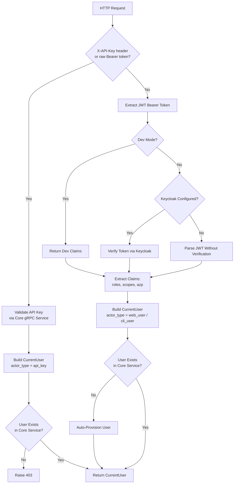
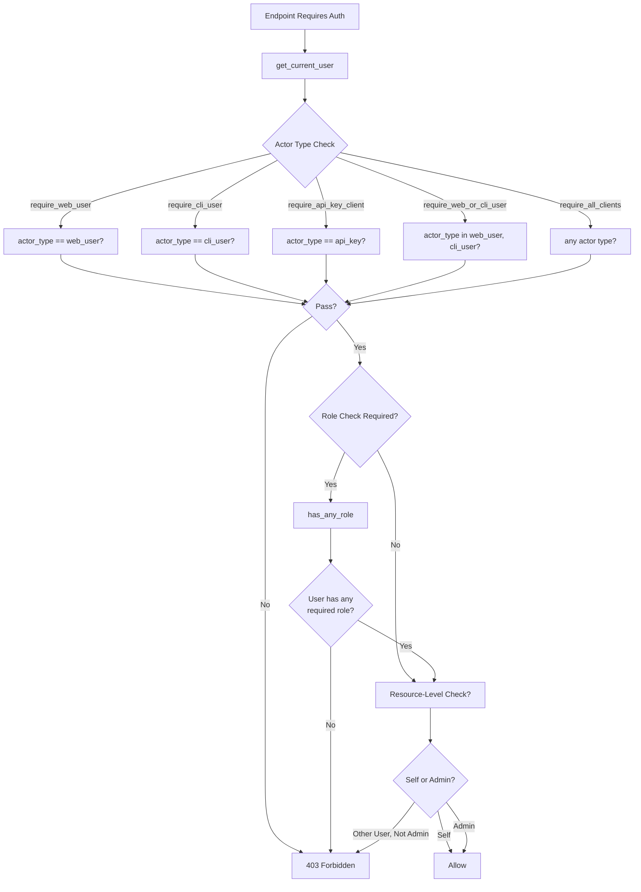
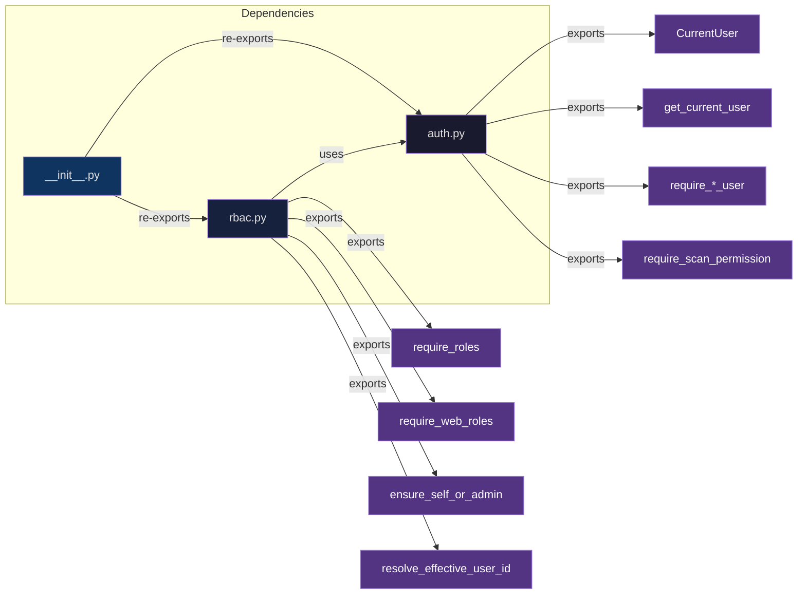

# Dependencies Module

## Overview

The `dependencies` module is the authentication and authorization layer for the FastAPI gateway. It provides a composable set of FastAPI dependency-injectable functions that handle identity verification, user provisioning, role-based access control (RBAC), and resource-level permission checks.

## What It Does

The module implements a two-tier security model:

### 1. Authentication (`auth.py`)

Validates the identity of incoming requests through two mechanisms:

- **JWT Bearer Token Authentication** -- Parses JWT tokens issued by Keycloak (or dev-mode fallback), extracts claims including roles, scopes, and authorized party, and builds a `CurrentUser` object.
- **API Key Authentication** -- Validates API keys passed via the `X-API-Key` header or as a raw Bearer token value against the core service.

After authentication, the module ensures the user exists in the core gRPC service, auto-provisioning if necessary.

### 2. Authorization (`rbac.py` + `auth.py`)

Enforces access control at multiple levels:

- **Actor Type Enforcement** -- Restricts endpoints to specific client types: `web_user`, `cli_user`, or `api_key`.
- **Role-Based Access Control** -- Checks platform-level roles (`USER`, `ADMIN`) extracted from Keycloak realm or resource-level roles.
- **Resource-Level Permissions** -- Implements the self-or-admin pattern, allowing users to access their own resources or admins to act on behalf of others.
- **Scan-Specific Permissions** -- Specialized guards for scan endpoints that restrict access to non-admin users with the `USER` role, and block API keys from destructive scan operations.

## Why We Need It

Centralizing authentication and authorization in this module provides several critical benefits:

- **Consistency** -- All route handlers use the same identity and permission logic, eliminating duplicate or conflicting implementations across endpoints.
- **Separation of Concerns** -- Route handlers focus on business logic; security concerns are declaratively expressed via dependency injection.
- **Composability** -- Dependencies are factories that return other dependencies, enabling fine-grained access control by combining primitives (e.g., "web user with ADMIN role" or "any actor type with USER role").
- **Maintainability** -- Changes to auth flows, role extraction, or permission logic are made in one place and propagate to all consumers.

## When It Is Needed

Every protected endpoint in the FastAPI gateway consumes one or more dependencies from this module. Specifically:

| Scenario | Dependency Used |
|---|---|
| Verify any authenticated platform user | `require_platform_user` |
| Restrict to web users only | `require_web_user` |
| Restrict to web or CLI users with platform role | `require_web_or_cli_platform_user` |
| Admin-only web endpoints | `require_web_admin` |
| Basic scan endpoints (identity only, no role check) | `get_scan_current_user` |
| Scan endpoints with role enforcement | `require_scan_permission` |
| Destructive scan endpoints (no API keys) | `require_user_scan_permission` |
| API key management | `require_web_or_cli_platform_user` |
| User self-management or admin override | `ensure_self_or_admin`, `resolve_effective_user_id` |
| Category management (web only, no role check) | `require_web_user` |

## Architecture

### Authentication Flow



### Authorization Flow



### Module Structure



## Key Components

### `CurrentUser` Dataclass

Represents an authenticated and resolved user identity.

| Field | Type | Description |
|---|---|---|
| `user_id` | `str` | Unique identifier from the identity provider |
| `azp` | `str` | Authorized party (client ID that issued the token) |
| `actor_type` | `ActorType` | One of `web_user`, `cli_user`, `api_key` |
| `roles` | `list[str]` | Normalized uppercase roles from Keycloak |
| `scopes` | `list[str]` | OAuth scopes from the token |
| `claims` | `dict` | Raw JWT claims |
| `project_id` | `str | None` | Associated project (for API key users) |
| `api_key_id` | `str | None` | API key identifier (for API key users) |
| `auth_method` | `str` | How the user was authenticated |

### Authentication Dependencies

| Dependency | Description |
|---|---|
| `get_current_user` | Primary entry point. Detects API key or JWT, builds `CurrentUser`, ensures user exists in core service |
| `get_current_claims` | Extracts raw JWT claims from HTTP Bearer credentials |

### Actor Type Restrictions

| Dependency | Allowed Actor Types |
|---|---|
| `require_web_user` | `web_user` only |
| `require_cli_user` | `cli_user` only |
| `require_api_key_client` | `api_key` only |
| `require_web_or_cli_user` | `web_user`, `cli_user` |
| `require_all_clients` | `web_user`, `cli_user`, `api_key` |

### Role-Based Access Control

| Dependency | Role Requirement | Actor Type Restriction |
|---|---|---|
| `require_platform_user` | `USER` or `ADMIN` | Any |
| `require_web_platform_user` | `USER` or `ADMIN` | `web_user` only |
| `require_web_or_cli_platform_user` | `USER` or `ADMIN` | `web_user`, `cli_user` |
| `require_web_admin` | `ADMIN` only | `web_user` only |

### Scan-Specific Permissions

| Dependency | Description |
|---|---|
| `require_scan_permission` | Allows API keys; requires `USER` or `ADMIN` role for web/CLI scan access |
| `require_user_scan_permission` | Same as above, but blocks API keys entirely (for destructive scan actions) |

### Resource-Level Helpers

| Helper | Description |
|---|---|
| `ensure_self_or_admin(current_user, target_user_id)` | Raises 403 unless the current user is accessing their own resources or is an `ADMIN` |
| `resolve_effective_user_id(current_user, requested_user_id)` | Returns the requested user ID if the current user is `ADMIN`; otherwise returns the current user's own ID |

## Usage Example

```python
from fastapi import APIRouter, Depends
from app.dependencies import CurrentUser, require_web_platform_user, ensure_self_or_admin

router = APIRouter()

@router.get("/users/{user_id}")
def get_user(
    user_id: str,
    current_user: CurrentUser = Depends(require_web_platform_user),
):
    ensure_self_or_admin(current_user, user_id)
    # ... business logic
```

## Router Consumption

Dependencies from this module are consumed across 9 router files:

| Router | Dependencies Used |
|---|---|
| `routers/apikey_router.py` | `CurrentUser`, `require_web_or_cli_platform_user` |
| `routers/auth.py` | `CurrentUser`, `require_platform_user` |
| `routers/project_router.py` | `CurrentUser`, `require_web_or_cli_platform_user` |
| `routers/category_router.py` | `CurrentUser`, `require_web_user` |
| `routers/users.py` | `CurrentUser`, `PLATFORM_ROLE_USER`, `ensure_self_or_admin`, `require_web_admin`, `require_web_platform_user` |
| `routers/integrations_git_account.py` | `CurrentUser`, `require_web_platform_user`, `resolve_effective_user_id` |
| `routers/tool_router.py` | `CurrentUser`, `require_scan_permission`, `require_web_user`, `ensure_self_or_admin` |
| `routers/basic_scan_router.py` | `CurrentUser`, `get_scan_current_user` |
| `routers/medium_scan_router.py` | `CurrentUser`, `require_scan_permission` |
| `routers/scan_router.py` | `CurrentUser`, `require_scan_permission`, `require_user_scan_permission` |
| `routers/sonarqube.py` | `PLATFORM_ROLE_ADMIN`, `CurrentUser`, `has_any_role`, `require_web_platform_user` |
