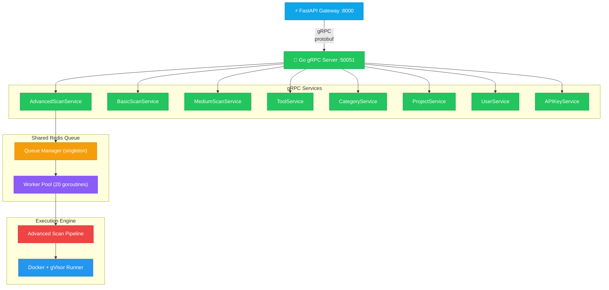
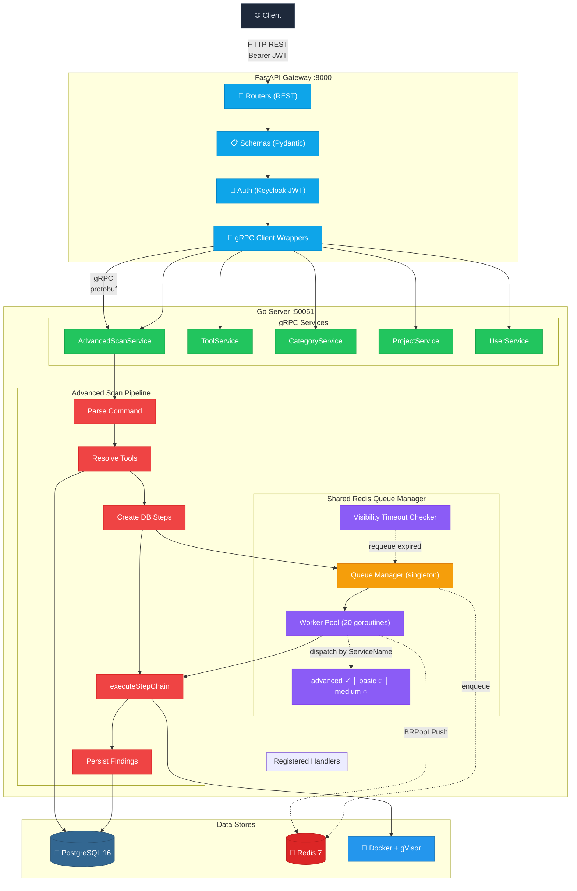
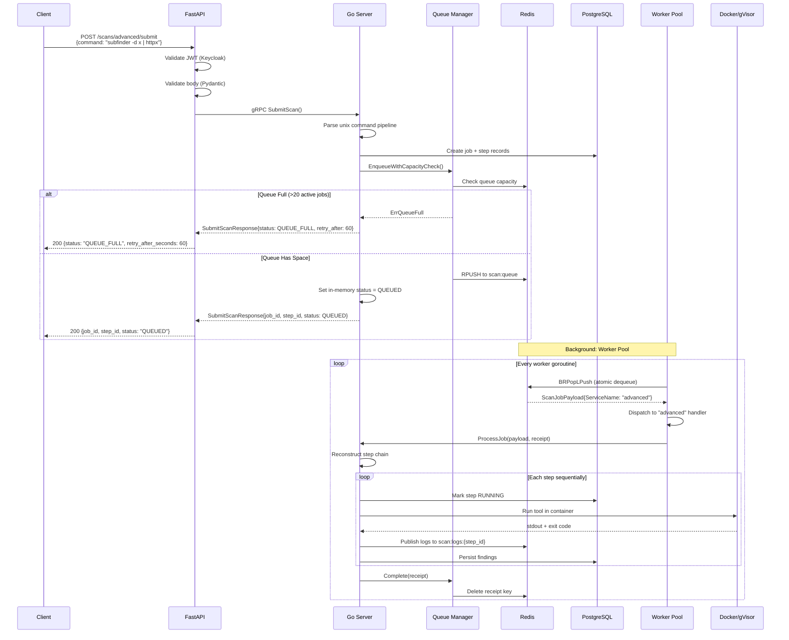

# Auto-Offensive Go Server

Core gRPC execution engine for the security scanning platform. Handles scan orchestration, tool execution pipeline, shared Redis queue management, Docker + gVisor container execution, and result persistence.

## Role in the Architecture



The Go server is the core execution engine — it receives gRPC scan requests, orchestrates tool execution in sandboxed containers, manages the shared Redis job queue, and persists findings to PostgreSQL.

## Tech Stack

| Layer           | Technology                                                        | Purpose                                                      |
| --------------- | ----------------------------------------------------------------- | ------------------------------------------------------------ |
| **API Gateway** | [FastAPI](https://fastapi.tiangolo.com/) (Python 3)               | HTTP REST API, request validation, auth                      |
| **Core Server** | [Go](https://go.dev/) 1.26                                        | gRPC service, business logic, scan execution                 |
| **Database**    | [PostgreSQL](https://www.postgresql.org/) 16                      | Persistent storage (users, projects, tools, jobs, findings)  |
| **Queue**       | [Redis](https://redis.io/) 7                                      | Shared job queue, pub/sub log streaming, visibility timeouts |
| **Execution**   | [Docker](https://www.docker.com/) + [gVisor](https://gvisor.dev/) | Sandboxed container execution of scanning tools              |
| **Auth**        | [Keycloak](https://www.keycloak.org/)                             | OAuth2/OIDC token verification, role-based access            |
| **IDL**         | [Protocol Buffers](https://protobuf.dev/) (gRPC)                  | Service contracts between FastAPI and Go server              |
| **SQL Gen**     | [sqlc](https://sqlc.dev/)                                         | Type-safe Go code from raw SQL queries                       |
| **Migrations**  | [Goose](https://github.com/pressly/goose)                         | PostgreSQL schema migrations                                 |

## Architecture



### Scan Submission Sequence



### How It Works

The sequence diagram above shows the full flow. In brief:

1. **Submit** — Client POSTs a command, FastAPI validates auth + body, Go parses it and enqueues to Redis
2. **Execute** — Worker pool dequeues, dispatches to the correct handler, runs tools in Docker sequentially
3. **Stream** — Logs published to Redis pub/sub in real-time, FastAPI forwards to browser via SSE

### Shared Queue Design

The queue is a **global singleton** initialized once in `main.go`. Any scan service (advanced, basic, medium) uses it by:

1. Implementing the `redis.ServiceHandler` interface (`ProcessJob` method)
2. Registering with `qm.RegisterHandler("serviceName", handler, "logPrefix")`
3. Setting `payload.ServiceName = "serviceName"` when enqueueing

Workers automatically route jobs to the correct handler. Max 20 jobs run concurrently; the 21st submission gets rejected with `QUEUE_FULL` and a `retry_after_seconds` hint.

## Scan Tool Architecture

The advanced scan pipeline is the core execution engine. It transforms a raw unix command string into a chain of sandboxed Docker container executions with real-time streaming, structured output capture, and automated result parsing.

### Execution Pipeline


### Step-by-Step Breakdown

#### 1. Command Parser (`command_parser.go`)

Parses a raw unix command like `subfinder -d scanme.nmap.org | httpx -sc -title` into typed steps:

- Splits on `|` pipe characters (respecting quotes and escapes)
- Tokenizes each segment: first token = tool name, remaining = flags + arguments
- Resolves tool definitions from the database by name
- Classifies flags into three buckets:
  - **Input fields** — mapped to the tool's `input_schema` (e.g. `-d` → `domain` field)
  - **Scan config options** — typed flags from `scan_config.medium.options` (e.g. `--json`)
  - **Raw custom flags** — anything else, passed through verbatim
- Extracts the target value from the first tool's arguments for auto-targeting

#### 2. Policy & Invocation (`policy.go`)

Builds the final command line that runs inside the container:

- **Security denylist** — blocks dangerous flags like `--interactive`, `--tty`, `--output`, `--debug`, `--proxy` (global + per-tool)
- **Target injection** — auto-fills the target value into the appropriate input field using heuristics (keys matching `target`, `host`, `hostname`, `domain`, `url`, `ip`, `cidr`)
- **Required input validation** — ensures all mandatory fields have values
- **Type coercion** — converts string arguments to integers, booleans, etc. based on `scan_config` type definitions
- **Sanity checks** — rejects null bytes and newlines in argument values
- **Arg ordering** — flagged inputs → positional inputs → option args → custom args

#### 3. Pipeline Transport (`pipeline_transport.go`)

Enables unix pipe semantics between steps:

- **`list_file` mode** — writes all upstream lines into a temp file, mounts it into the container with `--listflag /tmp/file.txt`
- **Default mode** — takes the first non-empty piped line and fills the first missing required input field of the next step
- Supports deduplication and line normalization

#### 4. Shadow Output (`shadow_transport.go`)

Captures tool output in structured format:

- Parses `shadow_output_config` JSON from the tool definition
- Resolves the preferred format (e.g. "json"), extracts enable flags and path flags
- Sets up Docker volume mounts for file-based transport
- After execution, reads the shadow file from disk (with retry/polling) or falls back to stdout
- Generates filenames from templates: `{job_id}_{step_id}_{tool_name}_{timestamp}.json`

#### 5. Docker Runner (`docker/docker_runner.go`)

Executes the tool in an isolated container:

- Pulls the Docker image (respects pull policy: `if_missing` or `never`)
- Builds `container.Config` (image, env, entrypoint=command, cmd=args, working dir)
- Builds `container.HostConfig` (bind mounts, memory/CPU limits)
- **gVisor sandbox** — sets `runtime: runsc` when `use_gvisor=true` for kernel-level isolation
- **Network mode** — bridge, host, or none (configurable per-tool or per-execution)
- **File injection** — copies files into the container via tar archive before start
- **Real-time log streaming** — reads Docker's multiplexed log stream, emits lines to the `OnLog` callback
- Waits for container exit, force-removes it, returns stdout/stderr/exit code

#### 6. Log Streaming (`logging.go`)

Publishes every log line to Redis pub/sub in real-time:

- Each log chunk gets a monotonically increasing `sequence_num`
- Source is tagged: `LOG_SOURCE_STDOUT`, `LOG_SOURCE_STDERR`, `LOG_SOURCE_SYSTEM`
- Published to Redis channel `scan:logs:{step_id}`
- Logs are also buffered in-memory per step (capped at 2000 most recent)
- `isFinalChunk` flag signals step completion to SSE clients

#### 7. Result Persistence (`persistence.go`)

Parses and stores findings after each step:

- **JSON array** — `[{title, severity, host, port, ...}, ...]`
- **JSON object** — looks for arrays under keys like `findings`, `results`, `vulnerabilities`, `issues`, `hosts`, `data`
- **XML** — nmap-specific parser extracting open ports with service info
- **Line-based fallback** — each stdout line becomes a finding with SHA-256 fingerprint
- **Deduplication** — fingerprint = `SHA-256(toolName|title|host|port)`; upserts on collision
- **Severity tracking** — computes highest severity across all findings per step
- **Shadow artifacts** — writes a JSON file containing the full execution record (command, args, exit code, stdout, stderr, shadow output, errors)

#### 8. Runtime Configuration (`runtime_config.go` + `image_policy.go`)

Resolves Docker runtime parameters per step:

- **gVisor** — defaults to `true`, overridden by `scan_config.runtime.use_gvisor`
- **Network mode** — from execution config → `scan_config.runtime.network_mode` → default bridge (only allows `bridge`, `host`, `none`)
- **Privileged** — from `scan_config.runtime.privileged`
- **Image pull policy** — `custom` or `local` source → never pull; everything else → pull if missing

### Tool Execution Flow (End-to-End)

```
Client: "subfinder -d example.com | httpx -sc -title"
                                      │
  ┌───────────────────────────────────▼───────────────────────────────────┐
  │ Step 1: subfinder                                                     │
  │  1. Policy check: deny --interactive, --output                        │
  │  2. Inject target: -d example.com (auto-detected)                     │
  │  3. Build args: [subfinder, -d, example.com]                          │
  │  4. Docker: runsecured with gVisor, bridge network                    │
  │  5. Stream logs → Redis pub/sub                                       │
  │  6. Capture stdout: ["sub1.example.com", "sub2.example.com", ...]    │
  │  7. Parse findings → PostgreSQL                                       │
  │  8. Extract pipeline output: deduplicated subdomains                  │
  └───────────────────────────────────┬───────────────────────────────────┘
                                      │ pipe: ["sub1.example.com", ...]
                                      ▼
  ┌───────────────────────────────────┴───────────────────────────────────┐
  │ Step 2: httpx                                                         │
  │  1. Policy check: deny --interactive, --output                        │
  │  2. Pipeline input: writes subdomains to /tmp/pipeline_input.txt      │
  │     Mounts file into container, injects -list /tmp/pipeline_input.txt │
  │  3. Build args: [httpx, -sc, -title, -list, /tmp/pipeline_input.txt] │
  │  4. Docker: run with gVisor, bridge network                           │
  │  5. Stream logs → Redis pub/sub                                       │
  │  6. Capture stdout: ["sub1.example.com 200 Home Page", ...]          │
  │  7. Parse findings → PostgreSQL                                       │
  └───────────────────────────────────────────────────────────────────────┘
```

### Architecture & Patterns

| Pattern                    | Where Used                                       | Why                                                                                       |
| -------------------------- | ------------------------------------------------ | ----------------------------------------------------------------------------------------- |
| **API Gateway**            | FastAPI proxies to Go via gRPC                   | Separation of concerns — FastAPI handles HTTP/auth/validation, Go handles execution       |
| **Shared Singleton Queue** | `redis/queue_manager.go`                         | Single source of truth for job scheduling across all scan services                        |
| **Handler Registration**   | `ServiceHandler` interface + `RegisterHandler()` | Loose coupling — services plug into the queue without owning it                           |
| **Visibility Timeout**     | Redis receipt keys with TTL                      | Crash recovery — if a worker dies mid-job, the job is automatically requeued              |
| **Capacity Enforcement**   | `EnqueueWithCapacityCheck`                       | Prevents resource exhaustion — hard limit of 20 active jobs                               |
| **Pipeline Transport**     | `pipeline_transport.go`                          | Unix pipe semantics — stdout of one tool becomes stdin of the next                        |
| **Shadow Output**          | `shadow_transport.go`                            | Captures tool output in both stdout and file formats simultaneously                       |
| **Command Parser**         | `command_parser.go`                              | Parses raw unix commands like `` `subfinder -d x \| httpx` `` into typed step definitions |
| **Idempotency**            | In-memory map with SHA-256 request hash          | Safe retries — identical requests return the original response                            |
| **Interceptors**           | gRPC unary + stream interceptors                 | Extracts `x-user-id` from HTTP header, injects into gRPC context                          |
| **Type-Safe SQL**          | sqlc generates Go from `.sql` files              | No ORM — raw SQL with compile-time type checking                                          |
| **Sandboxed Execution**    | Docker + gVisor (`runtime: runsc`)               | Each scan tool runs in an isolated kernel sandbox                                         |

## Project Structure

```
auto-offensive-backend/
├── docker-compose.yml              # Backend stack services (redis, postgres, keycloak, sonarqube, go, fastapi, worker)
├── Makefile                        # proto gen, sqlc, goose migrations, run
│
├── proto/                          # Protocol Buffer definitions
│   ├── advanced_scan.proto         # AdvancedScanService (11 RPCs)
│   ├── basic_scan.proto            # BasicScanService (5 RPCs)
│   ├── medium_scan.proto           # MediumScanService (8 RPCs)
│   ├── category.proto              # CategoryService (5 RPCs)
│   ├── create_tool.proto           # ToolService (5 RPCs)
│   ├── project.proto               # ProjectService (5 RPCs)
│   ├── user.proto                  # UserService (8 RPCs)
│   └── api_key.proto               # APIKeyService (4 RPCs)
│
├── go-server/                      # Go gRPC server
│   ├── cmd/main.go                 # Entry point — initializes queue manager, registers 8 services
│   ├── redis/                      # Shared queue package (all services use this)
│   │   ├── redis_client.go         # Redis client + pub/sub helper
│   │   ├── scan_queue.go           # Core queue: enqueue, dequeue, visibility timeout, capacity
│   │   ├── queue_manager.go        # Global singleton: InitManager, RegisterHandler, workers
│   │   └── queue_worker.go         # Worker loop: pull jobs, dispatch to ServiceHandler
│   ├── internal/
│   │   ├── database/               # PostgreSQL connection + migrations (goose)
│   │   ├── interceptor/            # gRPC user ID interceptors
│   │   └── services/
│   │       ├── user/               # UserService — CRUD + GitHub provider accounts
│   │       ├── project/            # ProjectService — CRUD
│   │       ├── category/           # CategoryService — CRUD
│   │       ├── tools/              # ToolService — CRUD + Docker image management
│   │       ├── apikey/             # APIKeyService — creation, validation, revocation
│   │       ├── git/                # GitService — GitHub integration
│   │       ├── sonarqube/          # SonarQubeService — code quality scanning
│   │       └── scan_tools/
│   │           ├── advanced_scan/  # Full scan pipeline (25 files)
│   │           │   ├── advanced_scan.go      # Server struct, constructor, background cleanup
│   │           │   ├── submit.go             # SubmitScan RPC — parse, validate, enqueue
│   │           │   ├── execute.go            # executeStepChain — run tools in Docker
│   │           │   ├── queue_worker.go       # ProcessJob — handler for queued jobs
│   │           │   ├── queue_status.go       # GetQueueStatus, GetJobQueuePosition, CancelQueuedJob
│   │           │   ├── status.go             # GetStepStatus, GetJobStatus
│   │           │   ├── results.go            # GetResults, GetJobSummary, GetStepSummary
│   │           │   ├── command_parser.go     # Parse unix command pipelines into steps
│   │           │   ├── pipeline_transport.go # Pipe stdout between tools
│   │           │   ├── shadow_transport.go   # Dual stdout+file output capture
│   │           │   ├── logging.go            # Redis pub/sub log publishing
│   │           │   ├── policy.go             # Tool execution policy (gVisor, network mode)
│   │           │   ├── image_policy.go       # Docker image selection logic
│   │           │   ├── runtime_config.go     # Runtime configuration from scan_config
│   │           │   ├── persistence.go        # DB result persistence
│   │           │   └── helpers.go            # Utility functions
│   │           ├── basic_scan/     # Basic scan service (single tool scans)
│   │           └── medium_scan/    # Medium scan service (typed option scans)
│   ├── docker/                     # Docker runner — container lifecycle management
│   └── gen/                        # Generated Go code from .proto files
│
├── fastapi-gateway/                # Python HTTP API gateway
│   ├── app/
│   │   ├── routers/
│   │   │   ├── scan_router.py      # Advanced scan endpoints (submit, status, results, queue, stream)
│   │   │   ├── tool_router.py      # Tool CRUD + activate
│   │   │   ├── project_router.py   # Project CRUD
│   │   │   ├── category_router.py  # Category CRUD
│   │   │   ├── users.py            # User CRUD
│   │   │   ├── auth.py             # /auth/me
│   │   │   └── integrations_git_account.py  # GitHub OAuth connect/callback
│   │   ├── internal/               # gRPC client wrappers (business logic)
│   │   │   ├── advanced_scan_client.py
│   │   │   ├── tool_client.py
│   │   │   ├── project_client.py
│   │   │   ├── category_client.py
│   │   │   └── grpc/user_client.py
│   │   ├── schemas/                # Pydantic request/response models
│   │   ├── dependencies/           # FastAPI dependencies (auth)
│   │   │   └── auth.py             # JWT verification, role checks, actor type routing
│   │   ├── core/                   # Config and security utilities
│   │   └── gen/                    # Generated Python gRPC code from .proto files
│   └── Dockerfile
│
├── workers/
│   ├── builder/                    # Python-based Docker image builder for custom tools
│   └── scanner/                    # Python scanner worker
│
├── *.json                          # Tool definitions (nmap, nuclei, subfinder, httpx, naabu, gobuster, gitleaks)
├── ADDING_TOOLS.md                 # Guide for adding new security tools via JSON
├── advanced_scan_flow.md           # Deep dive into the advanced scan execution pipeline
└── Future_Improvement.md           # Proposed enhancements with implementation details
```

## Endpoints

### HTTP REST API (FastAPI — `localhost:8000`)

All endpoints require `Authorization: Bearer <token>` unless noted.

#### Authentication

| Method | Path       | Description                             |
| ------ | ---------- | --------------------------------------- |
| GET    | `/auth/me` | Get current user info from token claims |

#### Users

| Method | Path               | Description                 |
| ------ | ------------------ | --------------------------- |
| POST   | `/users`           | Create user (Keycloak + DB) |
| GET    | `/users`           | List all users              |
| GET    | `/users/{user_id}` | Get user by ID              |
| PATCH  | `/users/{user_id}` | Update user                 |
| DELETE | `/users/{user_id}` | Delete user                 |

#### Projects

| Method | Path                     | Description                      |
| ------ | ------------------------ | -------------------------------- |
| POST   | `/projects`              | Create project                   |
| GET    | `/projects`              | List projects (filtered by user) |
| GET    | `/projects/{project_id}` | Get project by ID                |
| PATCH  | `/projects/{project_id}` | Update project                   |
| DELETE | `/projects/{project_id}` | Delete project                   |

#### Tools

| Method | Path                        | Description                   |
| ------ | --------------------------- | ----------------------------- |
| POST   | `/tools`                    | Create tool                   |
| GET    | `/tools`                    | List all tools                |
| GET    | `/tools/{tool_id}`          | Get tool by ID                |
| PUT    | `/tools/{tool_id}`          | Update tool                   |
| DELETE | `/tools/{tool_id}`          | Delete tool                   |
| PATCH  | `/tools/{tool_id}/activate` | Soft-activate/deactivate tool |

#### Categories

| Method | Path                        | Description         |
| ------ | --------------------------- | ------------------- |
| POST   | `/categories`               | Create category     |
| GET    | `/categories`               | List all categories |
| GET    | `/categories/{category_id}` | Get category by ID  |
| PUT    | `/categories/{category_id}` | Update category     |
| DELETE | `/categories/{category_id}` | Delete category     |

#### Advanced Scans

| Method | Path                                           | Description                                     |
| ------ | ---------------------------------------------- | ----------------------------------------------- |
| POST   | `/scans/advanced/submit`                       | Submit scan command, returns job_id             |
| GET    | `/scans/advanced/steps/{step_id}`              | Get step status                                 |
| GET    | `/scans/advanced/jobs/{job_id}`                | Get job status with step summaries              |
| GET    | `/scans/advanced/results`                      | Get findings/results with filters               |
| GET    | `/scans/advanced/jobs/{job_id}/findings`       | Get findings for a job                          |
| GET    | `/scans/advanced/steps/{step_id}/findings`     | Get findings for a step                         |
| GET    | `/scans/advanced/jobs/{job_id}/summary`        | Get job summary with severity counts            |
| GET    | `/scans/advanced/steps/{step_id}/summary`      | Get step summary                                |
| GET    | `/scans/advanced/steps/{step_id}/raw-output`   | Get raw tool output                             |
| GET    | `/scans/advanced/steps/{step_id}/logs/stream`  | Stream logs via SSE (EventSource)               |
| GET    | `/scans/advanced/queue/status`                 | Get queue status (queued, processing, capacity) |
| GET    | `/scans/advanced/queue/jobs/{job_id}/position` | Get job position in queue                       |
| POST   | `/scans/advanced/queue/jobs/{job_id}/cancel`   | Cancel a queued job                             |

#### Integrations

| Method | Path                               | Description                    |
| ------ | ---------------------------------- | ------------------------------ |
| GET    | `/integrations/github/connect-url` | Get GitHub OAuth connect URL   |
| GET    | `/integrations/github/callback`    | GitHub OAuth callback handler  |
| GET    | `/integrations/github/accounts`    | List connected GitHub accounts |

### gRPC Services (Go Server — `localhost:50051`)

#### AdvancedScanService (11 RPCs)

| RPC                   | Description                                         | Stream?              |
| --------------------- | --------------------------------------------------- | -------------------- |
| `SubmitScan`          | Submit a scan command for async execution           | Unary                |
| `GetStepStatus`       | Get status of a single step                         | Unary                |
| `GetJobStatus`        | Get full job status with all steps                  | Unary                |
| `GetQueueStatus`      | Get queue statistics (queued, processing, capacity) | Unary                |
| `GetJobQueuePosition` | Get position of a job in the queue                  | Unary                |
| `CancelQueuedJob`     | Remove a job from the queue if not yet processing   | Unary                |
| `StreamLogs`          | Stream log chunks for a step in real-time           | **Server-streaming** |
| `GetResults`          | Get paginated findings with filters                 | Unary                |
| `CancelStep`          | Cancel a running step                               | Unary                |
| `CancelJob`           | Cancel a running job                                | Unary                |
| `HealthCheck`         | Service health check                                | Unary                |

#### BasicScanService (5 RPCs)

| RPC           | Description               | Stream? |
| ------------- | ------------------------- | ------- |
| `SubmitScan`  | Submit a single tool scan | Unary   |
| `GetStatus`   | Get scan status           | Unary   |
| `GetResults`  | Get scan results          | Unary   |
| `Cancel`      | Cancel a running scan     | Unary   |
| `HealthCheck` | Service health check      | Unary   |

> **Note:** BasicScanService delegates to AdvancedScanService internally for execution.

#### MediumScanService (8 RPCs)

| RPC              | Description                    | Stream? |
| ---------------- | ------------------------------ | ------- |
| `SubmitScan`     | Submit scan with typed options | Unary   |
| `GetStatus`      | Get scan status                | Unary   |
| `GetResults`     | Get scan results               | Unary   |
| `GetQueueStatus` | Get queue statistics           | Unary   |
| `Cancel`         | Cancel a running scan          | Unary   |
| `ListPresets`    | List available scan presets    | Unary   |
| `GetPreset`      | Get a specific preset          | Unary   |
| `HealthCheck`    | Service health check           | Unary   |

> **Note:** MediumScanService provides typed option scans with structured input validation.

#### UserService (8 RPCs)

| RPC                           | Description                                      |
| ----------------------------- | ------------------------------------------------ |
| `CheckUserExists`             | Check if a user exists by ID, email, or username |
| `CreateUser`                  | Create a new user                                |
| `GetUser`                     | Get user by ID                                   |
| `ListUsers`                   | List all users                                   |
| `UpdateUser`                  | Update user                                      |
| `DeleteUser`                  | Soft-delete user                                 |
| `UpsertGithubProviderAccount` | Link GitHub OAuth account to user                |
| `ListProviderAccounts`        | List provider accounts for a user                |

#### ToolService (5 RPCs)

| RPC             | Description                                  |
| --------------- | -------------------------------------------- |
| `CreateTool`    | Register a new scanning tool (from JSON def) |
| `GetTool`       | Get tool by ID                               |
| `ListTools`     | List all tools (with optional filters)       |
| `UpdateTool`    | Update tool configuration                    |
| `SetToolActive` | Activate/deactivate tool                     |

#### ProjectService (5 RPCs)

| RPC             | Description                    |
| --------------- | ------------------------------ |
| `CreateProject` | Create a new project           |
| `GetProject`    | Get project by ID              |
| `ListProjects`  | List projects for current user |
| `UpdateProject` | Update project                 |
| `DeleteProject` | Delete project                 |

#### CategoryService (5 RPCs)

| RPC              | Description            |
| ---------------- | ---------------------- |
| `CreateCategory` | Create a tool category |
| `GetCategory`    | Get category by ID     |
| `ListCategories` | List all categories    |
| `UpdateCategory` | Update category        |
| `DeleteCategory` | Delete category        |

#### APIKeyService (4 RPCs)

| RPC              | Description                                    |
| ---------------- | ---------------------------------------------- |
| `CreateApiKey`   | Create a new API key (for CI/CD pipelines)     |
| `ValidateApiKey` | Validate an API key and return associated user |
| `RevokeApiKey`   | Revoke an API key                              |
| `ListApiKeys`    | List API keys for a user (with scope filters)  |

> **Note:** API keys support scoped access for CI/CD pipeline integration with role-based permissions.

## Queue Configuration

| Environment Variable      | Default           | Description                                                            |
| ------------------------- | ----------------- | ---------------------------------------------------------------------- |
| `SCAN_QUEUE_NAME`         | `scan:queue`      | Redis key for the main queue                                           |
| `SCAN_PROCESSING_NAME`    | `scan:processing` | Redis key for jobs being processed                                     |
| `SCAN_MAX_CONCURRENT`     | `20`              | Max jobs processed simultaneously (worker count)                       |
| `SCAN_MAX_QUEUE_CAPACITY` | `20`              | Max total active jobs. Jobs beyond this are rejected with `QUEUE_FULL` |

## Quick Start

```bash
# 1. Set environment variables
cp .env.example .env   # Edit DB credentials

# 2. Start infrastructure
docker compose up -d redis postgres sonarqube keycloak

# 3. Generate gRPC code from .proto files
make proto

# 4. Generate type-safe SQL code
make sqlc

# 5. Run database migrations
make goose-up

# 6. Start all services
docker compose up --build
```

Services available at:

- **FastAPI Gateway**: `http://localhost:8000`
- **Go gRPC Server**: `localhost:50051`
- **PostgreSQL**: `localhost:5432`
- **Redis**: `localhost:6379`
- **SonarQube**: `http://localhost:9000`
- **Keycloak**: `http://localhost:8080`

## Development

```bash
# Re-generate code after .proto changes
make proto

# Re-generate SQL code after .sql changes
make sqlc

# Create a new database migration
make goose-create

# Run the Go server directly (for debugging)
make run-go
```
