# Medium Scan Flow — Detailed Architecture

## Table of Contents

1. [Overview](#overview)
2. [Objective](#objective)
3. [Key Components](#key-components)
4. [Data Model](#data-model)
5. [Request Submission Flow](#request-submission-flow)
6. [Medium Option Validation Flow](#medium-option-validation-flow)
7. [Invocation Planning Flow](#invocation-planning-flow)
8. [Step Execution Flow](#step-execution-flow)
9. [Real-Time Log Publishing via Redis](#real-time-log-publishing-via-redis)
10. [Result Persistence & Finding Extraction](#result-persistence--finding-extraction)
11. [Status Tracking & Job Lifecycle](#status-tracking--job-lifecycle)
12. [Results Retrieval](#results-retrieval)
13. [Idempotency Mechanism](#idempotency-mechanism)
14. [Design Notes](#design-notes)

---

## Overview

The `medium_scan` module implements a **single-tool, single-step, Docker-based scan flow** for tools that expose a curated set of user-safe options.

Unlike `advanced_scan`, which accepts multi-step pipeline commands, `medium_scan` accepts:

- one project
- one target
- one tool
- one validated option map

It then:

1. validates ownership and idempotency
2. resolves or creates the target
3. converts medium options into CLI flags
4. builds a runnable invocation plan
5. launches one isolated Docker step
6. captures logs, artifacts, raw output, and findings

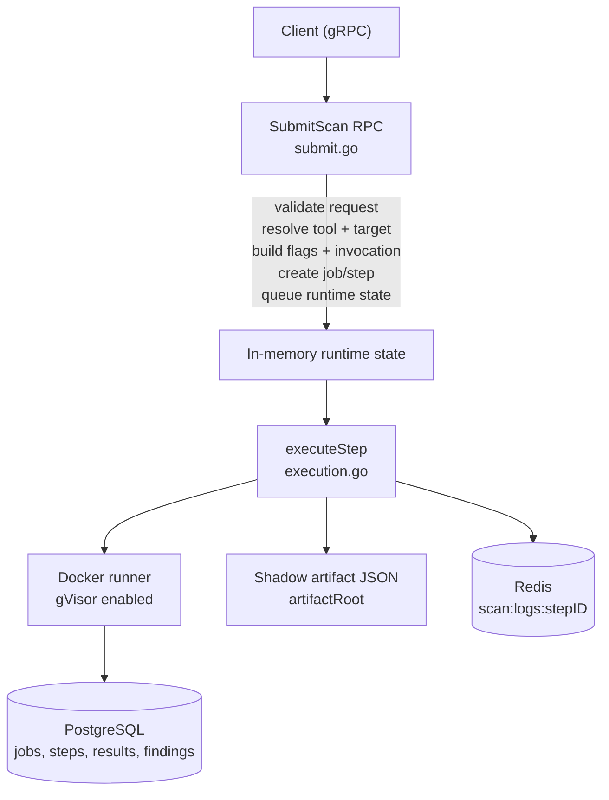

---

## Objective

The goal of `medium_scan` is to provide a safer and simpler scan mode than `advanced_scan`.

It is designed for cases where:

- the user should not submit arbitrary shell-like pipelines
- only predefined tool options are allowed
- the scan should always execute as a single step
- the backend still needs consistent persistence, logging, and runtime tracking

A key design choice is that medium scan **reuses advanced scan invocation building** after first converting the constrained option set into advanced-compatible custom flags. This keeps execution behavior consistent across scan modes while preserving a narrower user input surface.

---

## Key Components

| File | Responsibility |
| --- | --- |
| `service.go` | Server struct, constructor, in-memory runtime maps |
| `submit.go` | `SubmitScan`, idempotency registration, DB row creation, goroutine launch |
| `status.go` | `GetScanStatus`, `GetStepStatus`, `GetJobStatus`, `StreamLogs`, `CancelScan`, `HealthCheck` |
| `results.go` | `GetResults`, finding filtering, pagination, proto mapping |
| `execution.go` | `executeStep`, artifact writing, scan result persistence, finding extraction |
| `runtime.go` | Runtime transitions, DB sync helpers, status derivation |
| `logging.go` | Redis log publication and log buffer maintenance |
| `resolve.go` | Tool lookup, target lookup/creation, target type inference |
| `invocation.go` | Medium option decoding, schema inference, advanced invocation delegation |
| `build.go` | Medium option-to-flag assembly |
| `extract.go` | Allowed option extraction from tool config |
| `validate.go` | Option type validation and normalization |
| `helpers.go` | Shared helpers for step keys, env defaults, timestamps, string trimming |

---

## Data Model

### In-Memory Runtime State

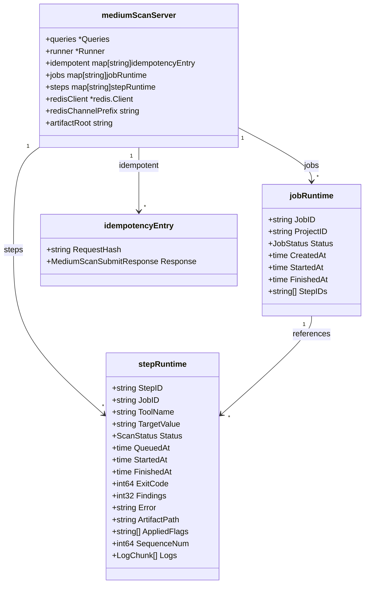

### Persistence Shape

`medium_scan` uses the same underlying database tables as other scan modes:

- `scan_jobs`
- `scan_steps`
- `scan_results`
- `findings`
- `targets`
- `tools`
- `projects`

The important difference is behavioral, not structural: medium scan creates **exactly one step per job**.

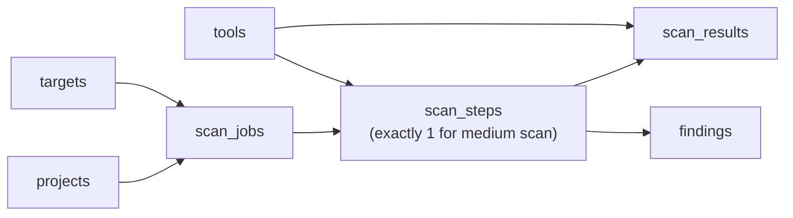

---

## Request Submission Flow

### Entry Point: `SubmitScan` (`submit.go`)

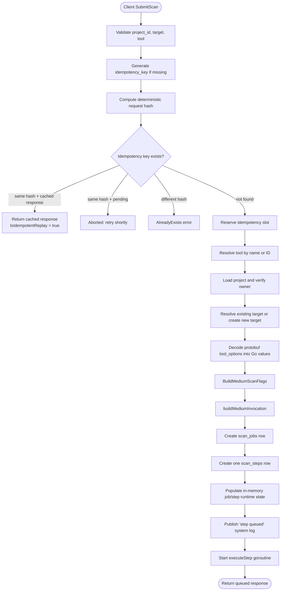

Notes:

- `target_id` can fall back to `target_value` semantics when it is non-empty but not a UUID.
- project ownership is enforced through `interceptor.RequireUserID`.
- idempotency is tracked in memory, not in the database.

---

## Medium Option Validation Flow

The medium scan path narrows tool input to only the options declared in tool config under `scan_config.medium.options`.

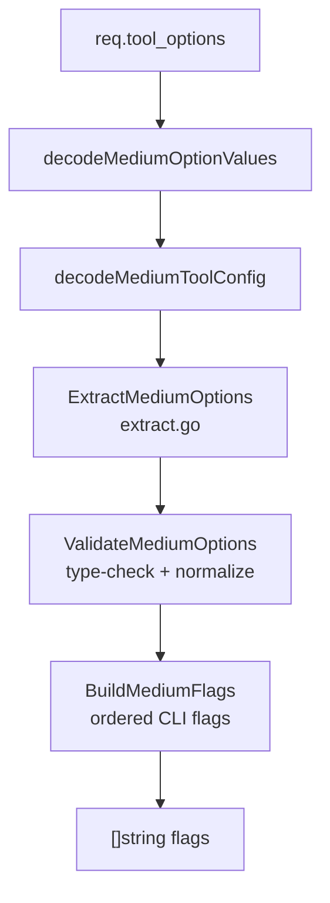

Validation rules:

- unknown options are rejected
- each option must match its declared type: `boolean`, `integer`, or `string`
- flag order follows the tool config order, not request map iteration order
- boolean flags are only emitted when `true`

---

## Invocation Planning Flow

`medium_scan` does not build raw shell strings. It builds a structured invocation plan and reuses advanced scan policy/invocation logic.

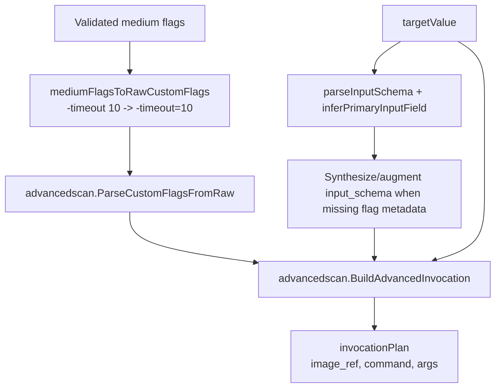

Why this matters:

- medium scan keeps a constrained UX
- advanced scan keeps the mature invocation builder
- tools with incomplete `input_schema` still work because medium scan infers the primary input field and common flags like `-d`, `-host`, or `-u`

---

## Step Execution Flow

`executeStep` is the full runtime path for the only step in a medium scan job.

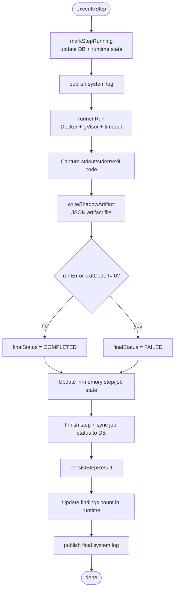

Execution characteristics:

- runtime timeout is resolved in this order: step override -> request override -> global default
- server-side maximum timeout still applies when configured
- Docker execution is forced through gVisor
- stdout and stderr are streamed into the in-memory log buffer and Redis
- artifact writing is best-effort and failure is logged without aborting the full flow

---

## Real-Time Log Publishing via Redis

Each step keeps an in-memory rolling log buffer and also publishes logs to Redis.

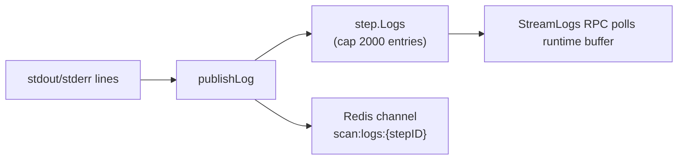

Behavior details:

- `publishLog` increments a per-step sequence number
- the Redis payload is JSON
- `StreamLogs` reads from in-memory state, not Redis subscriptions
- terminal steps return after all buffered logs are sent

---

## Result Persistence & Finding Extraction

After execution, medium scan persists one `scan_results` row and zero or more `findings`.

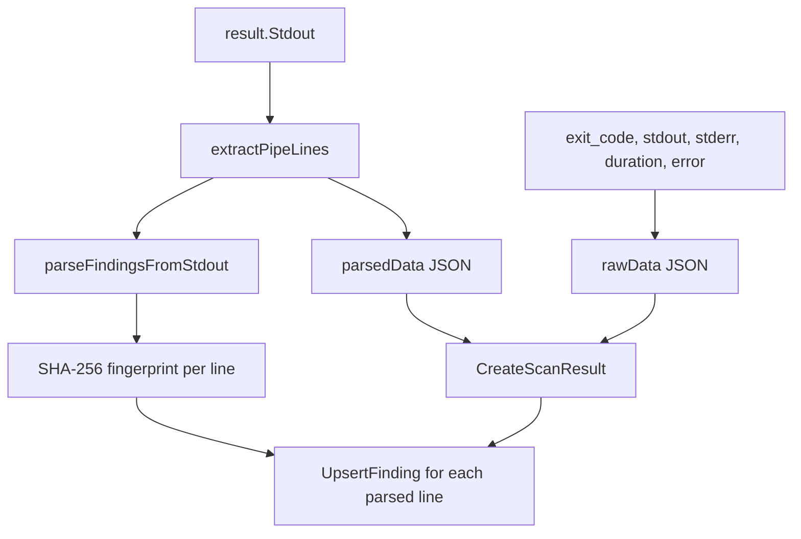

Current parsing behavior is intentionally simple:

- each non-empty stdout line becomes one informational finding
- host and port are inferred when the line looks like a URL or `host:port`
- findings are deduplicated by fingerprint through `UpsertFinding`

This is a lightweight extraction model compared with `advanced_scan`, which supports richer format-aware parsing.

---

## Status Tracking & Job Lifecycle

Medium scan keeps richer runtime state in memory than it persists in database enums.

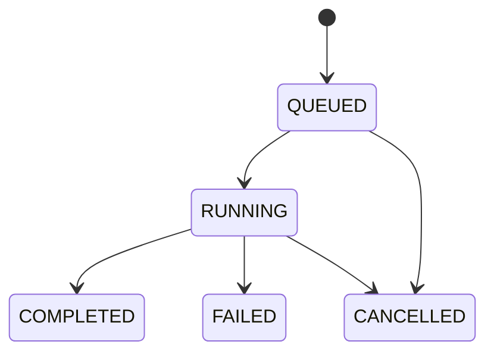

Job status is derived from step states:

- `PENDING` before execution starts
- `RUNNING` while the single step is queued or running
- `COMPLETED` when the step succeeds
- `FAILED` when the step fails
- `CANCELLED` when explicitly cancelled
- `PARTIAL` exists in shared status derivation logic but is not expected in normal medium scan flow because there is only one step

---

## Results Retrieval

`GetResults` supports either job-scoped or step-scoped retrieval.

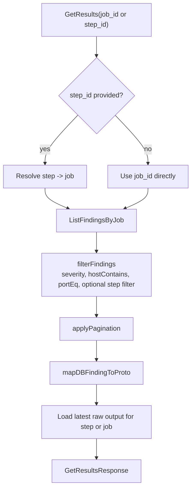

Returned payload can include:

- paginated findings
- total count
- inline raw output from the latest matching `scan_results` row

---

## Idempotency Mechanism

Medium scan implements a process-local idempotency cache.

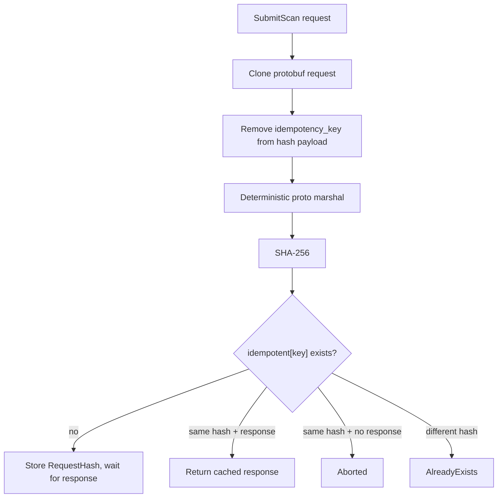

Important limitation:

- idempotency state is memory-resident, so it does not survive process restarts and is not shared across replicas

---

## Design Notes

### 1. Medium scan is intentionally not a mini advanced scan

It does not support:

- multi-step chains
- Unix pipeline parsing
- arbitrary custom commands
- inter-step transport

It supports one controlled tool execution with one target.

### 2. Invocation reuse is deliberate

Instead of duplicating tool argv policy logic, medium scan converts its validated flags into advanced-compatible custom flags and delegates the final invocation build to `advanced_scan`.

### 3. Runtime state is the source of truth for live status

`GetStepStatus`, `GetJobStatus`, and `StreamLogs` read in-memory maps first, which is why clients see queued/running transitions immediately.

### 4. Persistence is coarse but consistent

Even though medium scan is simpler, it still persists:

- job rows
- step rows
- raw result blobs
- parsed line metadata
- deduplicated findings
- artifact files on disk

### 5. Cancellation is state-only

`CancelScan` marks runtime state and syncs terminal statuses to the DB, but it does not currently terminate an already running Docker container directly.
